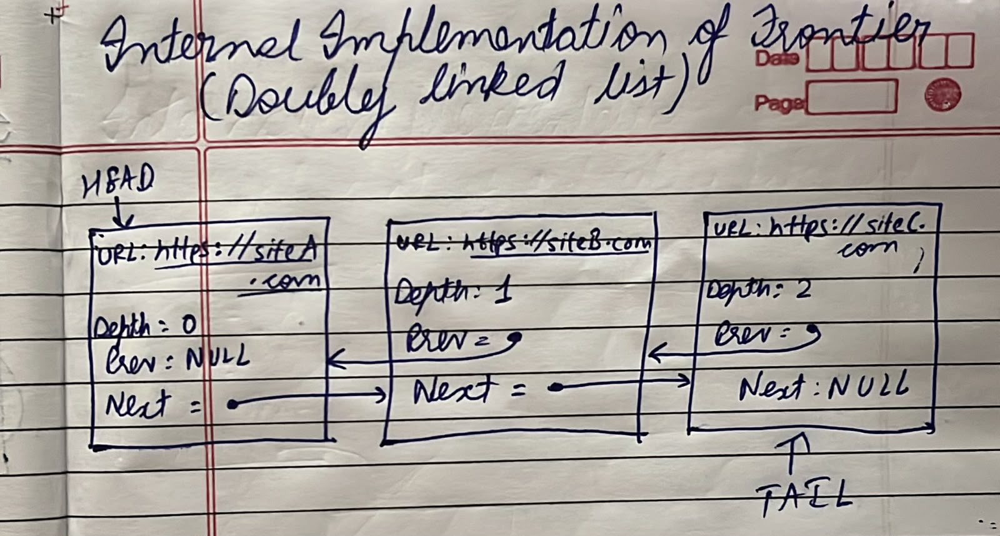
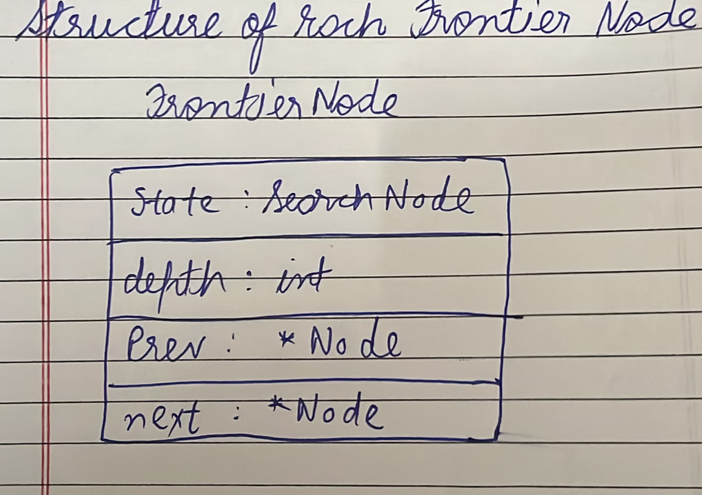

# Project 2 - Web Crawler

# Component 1 - URL Frontier

## Objective

The **URL Frontier** is responsible for managing the list of URLs that the web crawler needs to visit. Its primary objective is to organize, prioritize, and schedule URLs for crawling while ensuring that each webpage is visited efficiently and without unnecessary duplication.

The URL Frontier maintains a queue of pending URLs, adds newly discovered links from the HTML Parser, and provides the next URL to the crawler based on the crawling strategy (e.g., FIFO, priority-based, or depth-first).

By controlling the order and frequency of URL visits, the URL Frontier improves crawling efficiency, prevents repeated visits to the same webpage, and helps ensure comprehensive coverage of the target websites.

---

# Section 1 - Public API

| Function | Parameters | Return Type | Purpose |
|----------|------------|-------------|---------|
| `addURL(node)` | `node : URLNode` | `void` | Adds a new URL node (URL and crawl depth) to the frontier queue for future crawling. |
| `getNextURL()` | None | `URLNode` | Retrieves and removes the next URL node from the frontier following FIFO order. |
| `peekNextURL()` | None | `const URLNode&` | Returns the next URL node in the frontier without removing it from the queue. |
| `isEmpty()` | None | `bool` | Checks whether the frontier queue contains any pending URL nodes. |
| `getFrontierSize()` | None | `size_t` | Returns the total number of URL nodes currently stored in the frontier queue. |
| `clearFrontier()` | None | `void` | Removes all URL nodes from the frontier and resets the queue. |
### Class Definition

```cpp
class URLFrontier
{
public:
    void addURL(string url);
    string getNextURL();
    string peekNextURL();
    bool isEmpty();
    int getFrontierSize();
    void clearFrontier();
};
```

---

# Section 2 - Internal Representation




A URL Frontier can be implemented as a **Doubly Linked List** or **Priority Queue**.

Each node stores:

- URL
- Search state
- Depth
- Pointer to previous node
- Pointer to next node


# Section 3 - Failure Handling

The frontier stores URLs waiting to be crawled. Several exceptional situations must be handled to ensure reliable crawling.

---

## 1. Invalid URLs

Before adding a URL, validate it.

### Handling

- Check whether the URL format is correct.
- Ignore unsupported protocols:
  - `ftp://`
  - `mailto:`
  - `javascript:`
- Reject malformed URLs.

### Example

```text
https://example.com/page1      ✓ Added

htp://example.com              ✗ Invalid protocol

javascript:void(0)             ✗ Ignored
```

---

## 2. Duplicate URLs

The frontier maintains a **Visited Set** and a **Discovered Set**.

Before inserting a URL:

- Check whether it already exists in the frontier.
- Check whether it has already been visited.

If found, ignore the URL.

### Example

```text
Visited:

https://example.com

New URL:

https://example.com

Result:

Duplicate → Not added
```

---

## 3. Download Failures

Sometimes a page cannot be downloaded.

### Handling

- Retry download several times.
- Mark URL as **FAILED** if retries exceed the limit.
- Continue crawling other URLs.

### Example

```text
Download:

https://example.com

Attempt 1 → Timeout

Attempt 2 → Timeout

Attempt 3 → Failed

Result:

Move URL to Failed List
Continue crawling
```

---

## 4. Malformed HTML

Some webpages contain invalid HTML.

### Handling

- Use an HTML parser capable of recovering from malformed HTML.
- Extract valid links.
- Ignore corrupted sections.

### Example

```html
<html>
<body>

<a href="page2.html">Page 2

<div>

<p>Missing closing tags
```

Result:

```text
Parser repairs HTML

Extracts:

page2.html

Continues crawling
```

---

## 5. Empty Pages

Some downloaded pages contain no useful content.

### Handling

- Mark page as visited.
- Store page if required.
- Add no new URLs.

### Example

```text
Downloaded Page

Content:

(empty)

Result:

Visited ✓

No URLs added
```

---

# Section 4 - Complexity Analysis

| Operation | Best | Average | Worst | Reason |
|-----------|------|----------|-------|--------|
| `addURL()` | O(1) | O(1) | O(1) | Inserts a URL node at the rear of the queue. |
| `getNextURL()` | O(1) | O(1) | O(1) | Removes the front URL node directly from the queue. |
| `peekNextURL()` | O(1) | O(1) | O(1) | Returns the front URL node without removing it. |
| `isEmpty()` | O(1) | O(1) | O(1) | Checks whether the queue contains any elements. |
| `getFrontierSize()` | O(1) | O(1) | O(1) | Returns the maintained count of URL nodes in the queue. |
| `clearFrontier()` | O(n) | O(n) | O(n) | Removes all URL nodes from the queue one by one, where **n** is the number of stored URLs. |
---

# Section 5 - Future Compatibility with Project 03 (Indexer)

The URL Frontier and Page Storage are designed so they can later be integrated with the **Indexer**.

| Function | Future Compatibility |
|----------|----------------------|
| `storePage(url, html, depth)` | Stores each crawled page and assigns it a unique ID. The Indexer later processes these pages. |
| `getPage(url)` | Retrieves the HTML corresponding to a URL. |
| `hasPage(url)` | Prevents duplicate page storage and verifies page existence. |
| `getURLByID(id)` | Enables sequential traversal of stored pages using page IDs. |
| `pageCount()` | Returns the total number of stored pages for indexing. |

---

## Example Usage by Project 03 (Indexer)

```cpp
for (int id = 0; id < pageCount(); id++)
{
    string url = getURLByID(id);
    string html = getPage(url);

    // Extract words and build the inverted index
}
```

# Component 2 - Seen Storage

## Objective

The **Seen Storage** is responsible for ensuring that each URL is discovered only once during the crawling process. Its primary objective is to prevent duplicate URL discovery, avoid infinite crawling loops, and improve the overall efficiency of the web crawler.

Whenever the HTML Parser discovers a new URL, the crawler first checks the Seen Storage. If the URL has not been seen before, it is added to both the Seen Storage and the URL Frontier. Otherwise, the URL is ignored.

---

# Section 1 - Public API

Seen Storage only requires methods to record and verify whether a URL has already been discovered.

| Method | Parameters | Return Type | Purpose |
|---------|------------|-------------|---------|
| `addSeenURL(url)` | `url : String` | `bool` | Adds a URL to Seen Storage. Returns `true` if added successfully; returns `false` if the URL already exists. |
| `isSeen(url)` | `url : String` | `bool` | Checks whether the specified URL has already been discovered. |
| `removeSeenURL(url)` *(Optional)* | `url : String` | `bool` | Removes a URL from Seen Storage if required. Returns `true` if removed successfully; otherwise returns `false`. |
| `seenCount()` | None | `int` | Returns the total number of URLs currently stored in Seen Storage. |
| `clearSeenStorage()` | None | `void` | Removes all stored URLs and resets the Seen Storage. |

### Class Definition

```cpp
class SeenStorage
{
public:
    bool addSeenURL(string url);
    bool isSeen(string url);
    bool removeSeenURL(string url);
    int seenCount();
    void clearSeenStorage();
};
```

---

# Section 2 - Internal Implementation


### Internal Data Structure

- Hash Set (`unordered_set<string>`)
- Stores only unique URLs.
- Duplicate URLs are automatically rejected.
- Supports constant-time lookup on average.

Workflow:

```text
New URL
    │
    ▼
isSeen(URL)?
    │
 ┌──┴──────┐
 │         │
Yes        No
 │          │
Ignore   addSeenURL()
            │
            ▼
      Add to Frontier
```

---

# Section 3 - Failure Handling

Seen Storage must handle several exceptional situations while recording discovered URLs.

| Failure | Handling |
|---------|----------|
| **Invalid URLs** | Validate the URL before storing it. Reject malformed URLs or unsupported schemes such as `ftp://`, `mailto:`, or `javascript:`. |
| **Duplicate URLs** | Check `isSeen(url)` before insertion. If the URL already exists, ignore it and return `false`. |
| **Hash Collision** | Resolve collisions using the hash table implementation (separate chaining or open addressing). Unique URLs remain accessible. |
| **Empty URL** | Reject empty strings or URLs containing only whitespace. |
| **Memory Limit** | If storage reaches its limit, report the failure gracefully, log the error, and continue processing existing URLs. |

---

## Examples

### Invalid URL

```text
https://example.com/page1     ✓ Added

javascript:void(0)            ✗ Ignored

htp://example.com             ✗ Invalid
```

---

### Duplicate URL

```text
Seen Storage

https://example.com

New URL

https://example.com

Result

Duplicate → Not Stored
```

---

### Empty URL

```text
URL

""

Result

Rejected
```

---

# Section 4 - Complexity Analysis

| Method | Best | Average | Worst | Purpose |
|--------|------|----------|-------|---------|
| `addSeenURL()` | O(1) | O(1) | O(n) | Inserts a unique URL into the hash set. |
| `isSeen()` | O(1) | O(1) | O(n) | Checks whether a URL already exists. |
| `removeSeenURL()` | O(1) | O(1) | O(n) | Removes a URL from the hash set. |
| `seenCount()` | O(1) | O(1) | O(1) | Returns the number of stored URLs. |
| `clearSeenStorage()` | O(n) | O(n) | O(n) | Removes every stored URL. |

---

# Section 5 - Future Compatibility

The Seen Storage is used only during the **crawling phase** to prevent duplicate URL discovery.

It is **not accessed by Project 03 (Indexer)** because the Indexer processes pages stored in Page Storage rather than URLs waiting to be crawled.

Its purpose is to ensure that each URL is discovered and processed only once, improving crawler efficiency and preventing duplicate page downloads.

| Method | Future Compatibility |
|---------|----------------------|
| `addSeenURL(url)` | Prevents duplicate URL discovery during crawling. Not used by the Indexer. |
| `isSeen(url)` | Ensures each URL is crawled only once. Not used by the Indexer. |
| `removeSeenURL(url)` *(Optional)* | Used only for crawler maintenance. Not required by the Indexer. |
| `seenCount()` | Provides crawler statistics only. |
| `clearSeenStorage()` | Resets the crawler before starting a new crawl session. |

---

## Relationship with the Web Crawler

```text
HTML Parser
      │
Extract URLs
      │
      ▼
 Seen Storage
      │
isSeen(URL)?
      │
 ┌────┴────┐
 │         │
Yes        No
 │          │
Ignore   addSeenURL()
            │
            ▼
      URL Frontier
```

The Seen Storage acts as a **filter** between the HTML Parser and the URL Frontier, ensuring that each unique URL enters the frontier only once.

# Component 3 - Page Storage

## Objective

The **Page Storage** module is responsible for efficiently storing all web pages collected by the crawler in a structured and organized manner.

It maintains the HTML content together with important metadata such as the page URL, crawl timestamp, HTTP status code, content type, and crawl status. The module eliminates duplicate pages to ensure efficient use of storage space while enabling fast retrieval of stored pages for indexing, searching, and further analysis.

The Page Storage module is also designed to support future scalability for handling large collections of crawled web pages.

---

# Section 1 - Public API

| Method | Return Type | Parameters | Purpose |
|---------|-------------|------------|---------|
| `storePage(Page page)` | `bool` | `Page page` | Stores a newly crawled web page and returns `true` if the operation succeeds. |
| `getPage(string url)` | `Page` | `string url` | Retrieves the stored page corresponding to the specified URL. |
| `updatePage(Page page)` | `bool` | `Page page` | Updates the HTML content or metadata of an existing page. |
| `deletePage(string url)` | `bool` | `string url` | Removes the page associated with the specified URL. |
| `pageExists(string url)` | `bool` | `string url` | Checks whether a page with the specified URL already exists. |
| `getAllPages()` | `vector<Page>` | None | Returns all stored pages for indexing or further processing. |
| `getPageMetadata(string url)` | `PageMetadata` | `string url` | Returns metadata associated with the specified page. |
| `clearStorage()` | `void` | None | Removes all stored pages and resets the storage. |

---

## Class Definition

```cpp
class PageStorage
{
public:
    bool storePage(Page page);

    Page getPage(string url);

    bool updatePage(Page page);

    bool deletePage(string url);

    bool pageExists(string url);

    vector<Page> getAllPages();

    PageMetadata getPageMetadata(string url);

    void clearStorage();
};
```

---

# Section 2 - Internal Implementation


---

## Workflow

1. The **Web Crawler** downloads a webpage.
2. The downloaded page is sent to the **Page Storage API**.
3. The **Duplicate Checker** verifies whether the page has already been stored.
4. The **Metadata Manager** extracts metadata including:
   - URL
   - Crawl timestamp
   - HTTP status code
   - Content type
   - Crawl depth
5. The **Storage Manager** stores both the HTML content and metadata.
6. The **Database/File System** persistently stores the page for later retrieval, indexing, and analysis.

---

## Internal Representation

Each stored page consists of two parts:

### HTML Content

```text
URL

↓

HTML Document
```

### Metadata

```text
URL

Crawl Timestamp

Status Code

Content Type

Depth

Content Length
```

Example:

```text
Page

URL:
https://example.com

HTML:
<html>...</html>

Metadata

Timestamp:
2026-07-04 10:20:30

Status:
200 OK

Content-Type:
text/html

Depth:
2
```

---

# Section 3 - Failure Handling

The Page Storage module must handle several failure scenarios to ensure reliable operation.

| Exception | Handling Strategy |
|-----------|-------------------|
| **Invalid URLs** | Validate the URL before storing. Reject malformed or unsupported URLs, log the error, and return failure. |
| **Duplicate URLs** | Check whether the page already exists. Skip storing or update the existing page according to the crawler's update policy. |
| **Download Failures** | Do not store pages that failed to download due to network errors, timeouts, or HTTP failures. Log the error and optionally schedule a retry. |
| **Malformed HTML** | Store the HTML if possible and mark the page as **Malformed** in the metadata. |
| **Empty Pages** | Store only minimal metadata or discard the page according to crawler policy. Mark the page with an **Empty Page** status. |

---

## Examples

### Invalid URL

```text
URL

htp://example.com

Result

Rejected
```

---

### Duplicate Page

```text
Stored Pages

https://example.com

New Page

https://example.com

Result

Already Exists

Skipped
```

---

### Download Failure

```text
Download

https://example.com

Timeout

Result

Not Stored

Logged
```

---

### Malformed HTML

```html
<html>

<body>

<a href="page.html">

<div>

<p>Missing closing tags
```

Result

```text
Stored

Metadata

Malformed = true
```

---

### Empty Page

```text
Downloaded HTML

(empty)
```

Result

```text
Status

Empty Page

Minimal Metadata Stored
```

---

# Section 4 - Complexity Analysis

| Method | Purpose | Best | Average | Worst |
|---------|---------|------|----------|-------|
| `storePage()` | Stores a newly crawled page. | O(1) | O(1) | O(n) |
| `getPage()` | Retrieves a page using its URL. | O(1) | O(1) | O(n) |
| `updatePage()` | Updates page content or metadata. | O(1) | O(1) | O(n) |
| `deletePage()` | Removes a stored page. | O(1) | O(1) | O(n) |
| `pageExists()` | Checks whether a page exists. | O(1) | O(1) | O(n) |
| `getAllPages()` | Returns all stored pages. | O(n) | O(n) | O(n) |
| `getPageMetadata()` | Retrieves metadata for a page. | O(1) | O(1) | O(n) |
| `clearStorage()` | Removes all stored pages. | O(n) | O(n) | O(n) |

---

# Section 5 - Future Compatibility

The **Indexer (Project 03)** will use the Page Storage module as its primary data source.

The crawler stores every downloaded webpage, and the indexer later retrieves those stored pages to:

- Extract words
- Build the inverted index
- Generate document IDs
- Support keyword searching

---

## Future API

| Method | Return Type | Parameters | Purpose | Used by Indexer |
|---------|-------------|------------|---------|-----------------|
| `storePage(string url, string html, int depth)` | `void` | `string url, string html, int depth` | Stores the crawled page. | No |
| `getPage(string url)` | `string` | `string url` | Returns the HTML content for indexing. | Yes |
| `hasPage(string url)` | `bool` | `string url` | Checks whether a page already exists. | Yes |
| `getURLByID(int id)` | `string` | `int id` | Returns the URL corresponding to a page ID. | Yes |
| `pageCount()` | `int` | None | Returns the total number of stored pages. | Yes |

---

## Example Usage by Project 03 (Indexer)

```cpp
for (int id = 0; id < pageCount(); id++)
{
    string url = getURLByID(id);

    string html = getPage(url);

    // Extract words

    // Build inverted index

    // Store term frequencies
}
```

---

# Relationship with the Web Crawler

```text
Fetcher
    │
    ▼
Downloaded HTML
    │
    ▼
Page Storage
    │
    ├───────────────┐
    │               │
    ▼               ▼
Metadata        HTML Content
    │               │
    └──────┬────────┘
           ▼
     Database / MySQL
           │
           ▼
     Indexer (Project 03)
```

The Page Storage module serves as the persistent storage layer of the crawler. Every successfully downloaded webpage is stored once, enriched with metadata, and made available for future indexing, searching, and analysis.

# Component 4 - HTML parser

## objective 

The objective of the HTML Parser module is to analyze the downloaded HTML content of a webpage, convert it into a structured format, and extract useful information such as page titles, headings, paragraphs, hyperlinks, images, and metadata. This structured data enables the web crawler to discover new URLs for further crawling and store relevant webpage content for indexing, analysis, or search.

# Section 1 Public API


| Method | Return Type | Parameters | Purpose |
|---------|------------|------------|---------|
| `bool parseHTML(const std::string& html)` | `bool` | `html` - Raw HTML document | Parses the HTML document and initializes the parser. Returns `true` if parsing is successful; otherwise returns `false`. |
| `std::string extractTitle() const` | `std::string` | None | Returns the content of the `<title>` tag. |
| `std::vector<std::string> extractHeadings() const` | `std::vector<std::string>` | None | Extracts all heading elements (`<h1>` to `<h6>`). |
| `std::vector<std::string> extractParagraphs() const` | `std::vector<std::string>` | None | Extracts text from all paragraph (`<p>`) elements. |
| `std::vector<std::string> extractLinks() const` | `std::vector<std::string>` | None | Extracts all hyperlinks from `<a href="">` elements. |
| `std::vector<std::string> extractImages() const` | `std::vector<std::string>` | None | Extracts image URLs from `` elements. |
| `std::map<std::string, std::string> extractMetaData() const` | `std::map<std::string, std::string>` | None | Extracts metadata such as description, keywords, author, and other meta tags. |
| `std::string getPlainText() const` | `std::string` | None | Returns the visible text content of the webpage after removing HTML tags. |
| `bool isParsed() const` | `bool` | None | Returns `true` if the HTML document has been successfully parsed; otherwise returns `false`. |
| `void clear()` | `void` | None | Clears all stored parser data and resets the parser state. |

# Section 2 Internal Implementation

The HTML Parser uses a lightweight sequential scanning approach to extract hyperlinks from an HTML document. Instead of constructing a Document Object Model (DOM), the parser directly scans the HTML string to locate anchor (`<a>`) tags and their corresponding `href` attributes. This approach reduces memory usage and improves performance, making it suitable for web crawling applications where only hyperlinks are required.

### Processing Steps

1. Receive the raw HTML document as a string.
2. Initialize the scanning position at the beginning of the document.
3. Search for the next occurrence of the `<a` tag.
4. Locate the `href` attribute within the anchor tag.
5. Verify that the `href` attribute contains a valid quoted URL.
6. Extract the URL between the quotation marks.
7. Store the extracted URL in a `std::vector<std::string>`.
8. Continue scanning from the end of the current tag until the end of the HTML document is reached.
9. Return the collection of extracted hyperlinks.

---

## Internal Data Structures

| Data Structure | Purpose |
|----------------|---------|
| `std::string` | Stores the raw HTML document. |
| `std::vector<std::string>` | Stores the extracted hyperlinks. |
| `size_t` | Maintains the current scanning position within the HTML document. |

---

## Internal Workflow

```text
Raw HTML
    │
    ▼
Sequential Scanner
    │
    ▼
Find "<a"
    │
    ▼
Find "href="
    │
    ▼
Extract URL
    │
    ▼
Validate URL
    │
    ▼
Store in Vector
    │
    ▼
Repeat Until End of Document
    │
    ▼
Return Extracted Links
```

---

## Design Characteristics

- Single-pass sequential scan of the HTML document.
- No DOM tree construction.
- Low memory consumption.
- Efficient hyperlink extraction.
- Gracefully skips malformed or invalid anchor tags.
- Suitable for large-scale web crawling.
# Section 3 Failure Handling

The Link Extractor is designed to handle malformed or incomplete HTML gracefully without interrupting the crawling process.

| Failure Scenario | Handling Strategy |
|------------------|-------------------|
| Empty HTML document | Return an empty list of links. |
| `<a>` tag not found | Continue scanning until the end of the document and return an empty list. |
| Missing `href` attribute | Skip the tag and continue scanning. |
| Empty `href` value | Ignore the link and continue scanning. |
| Unclosed `<a>` tag | Skip the malformed tag and continue scanning from the next position. |
| Invalid URL format | Ignore the URL or log it for debugging. |
| Duplicate links | Store links in a hash set before adding them to the output list to avoid duplicates. |
| Unexpected exceptions | Catch the exception, log the error, and return the links extracted so far. |

# Section 4 Complexity analysis

## Complexity Analysis

| Method | Purpose | Best Case | Average Case | Worst Case |
|--------|---------|-----------|--------------|------------|
| `parseHTML(const std::string& html)` | Scans the HTML document and extracts all hyperlinks. | **O(1)** (empty document or no content) | **O(n)** | **O(n)** |
| `extractLinks()` | Returns the collection of extracted links. | **O(1)** | **O(k)** | **O(k)** |
| `clear()` | Clears all extracted links and resets the parser. | **O(1)** (already empty) | **O(k)** | **O(k)** |
| `isParsed()` | Checks whether the HTML document has been parsed successfully. | **O(1)** | **O(1)** | **O(1)** |

### Notation

- **n** = Size of the HTML document (number of characters).
- **k** = Number of extracted hyperlinks.

# Section 5 Future Compatibility 

The current HTML Parser is designed to extract hyperlinks for web crawling. Its modular design allows it to be extended to support an Indexer without significant architectural changes.

### Future Enhancements

- Extract visible text from web pages for content indexing.
- Extract page titles to improve search result relevance.
- Extract metadata (description, keywords, author) for document indexing.
- Extract heading elements (`<h1>`–`<h6>`) to assign importance to page content.
- Compute term frequencies for ranking algorithms.
- Remove HTML tags and normalize text before indexing.
- Provide structured document data directly to the Indexer module.

### Integration Workflow

```text
Web Fetcher
      │
      ▼
HTML Parser
      │
      ├── Hyperlinks ─────────► URL Queue (Crawler)
      │
      └── Page Content ───────► Indexer
                                    │
                                    ▼
                             Inverted Index
                                    │
                                    ▼
                              Search Engine
```

### Benefits

- Reuses the existing parser without modifying the crawler.
- Supports efficient document indexing.
- Enables keyword-based searching.
- Provides a foundation for page ranking and search result generation.
- Simplifies future integration with search engine components.

# Component 5 - Fetcher

## Objective

The Fetcher is responsible for downloading web pages from the internet by sending HTTP/HTTPS requests to the specified URLs. It retrieves HTML or rendered page content, handles redirects and network errors, and provides the downloaded content to the HTML Parser for further processing and link extraction.

# Section 1 - Public API

| Return Type | Method | Parameters | Purpose |
|------------|--------|------------|---------|
| `FetchResult` | `fetch()` | `const std::string& url` | Downloads the HTML content of the specified URL and returns the response along with status information. |
| `void` | `setUserAgent()` | `const std::string& userAgent` | Sets the User-Agent header for HTTP requests. |
| `void` | `setTimeout()` | `int timeoutSeconds` | Sets the maximum time to wait for a server response before timing out. |
| `void` | `setMaxRedirects()` | `int maxRedirects` | Specifies the maximum number of HTTP redirects to follow automatically. |

## FetchResult Structure

```cpp
struct FetchResult {
    bool success;
    int statusCode;
    std::string finalUrl;
    std::string html;
    std::string errorMessage;
};
```
# Section 2 - Internal implementation 

The Fetcher is internally implemented using an HTTP client library (e.g., libcurl) to retrieve web pages over HTTP/HTTPS. It is responsible only for downloading page content and handling network communication.

## Working Steps

1. Accept a URL from the URL Frontier.
2. Validate the URL format.
3. Initialize the HTTP client (libcurl).
4. Configure request parameters:
   - User-Agent
   - Timeout
   - Maximum redirects
5. Send an HTTP/HTTPS GET request.
6. Receive the server's response.
7. If the server returns redirects (301/302), follow them up to the configured limit.
8. Store the downloaded HTML content in memory.
9. Record metadata such as:
   - Success status
   - HTTP status code
   - Final URL after redirects
   - Error message (if any)
10. Return the result to the HTML Parser.
11. Release all allocated network resources.

## Internal Workflow

```text
URL Frontier
      │
      ▼
 Receive URL
      │
      ▼
 Validate URL
      │
      ▼
 Configure libcurl
(User-Agent, Timeout, Redirects)
      │
      ▼
 Send HTTP GET Request
      │
      ▼
 Receive Response
      │
      ▼
 Store HTML + Status Information
      │
      ▼
 Return FetchResult
      │
      ▼
 HTML Parser
```
# Section 3 - Failure Handling 

The Fetcher includes failure handling to ensure that network and server errors do not interrupt the crawling process. Instead of terminating the crawler, it captures the error, records the failure information, and returns an appropriate `FetchResult` to the caller.

## Failure Handling Process

1. **Validate the URL**
   - Check whether the URL is properly formatted.
   - If invalid, stop the request and return an error.

2. **Send HTTP Request**
   - Attempt to establish a connection with the target server.

3. **Detect Network Errors**
   - Handle failures such as:
     - DNS resolution failure
     - Connection refused
     - Network unavailable
     - Connection reset

4. **Handle Timeout**
   - If the server does not respond within the configured timeout period, abort the request and report a timeout error.

5. **Handle SSL/TLS Errors**
   - Detect invalid or expired SSL certificates and other HTTPS-related issues.

6. **Process HTTP Status Codes**
   - **200 OK:** Download completed successfully.
   - **301/302:** Follow redirects until the configured redirect limit is reached.
   - **403 Forbidden:** Report access denied.
   - **404 Not Found:** Report that the requested page does not exist.
   - **500 Internal Server Error:** Report a server-side failure.

7. **Handle Redirect Limit**
   - If the number of redirects exceeds the configured maximum, stop following redirects and return an error.

8. **Return Failure Information**
   - Populate the `FetchResult` object with:
     - `success = false`
     - HTTP status code (if available)
     - Error message describing the failure
     - Final URL reached (if applicable)

9. **Continue Crawling**
   - The crawler logs the failure, skips the failed URL, and proceeds to fetch the next URL from the URL Frontier.

## Example

```text
URL
 │
 ▼
Send HTTP Request
 │
 ▼
Was the request successful?
 ├── Yes ─► Return HTML Content
 │
 └── No
      │
      ├── Invalid URL
      ├── DNS Failure
      ├── Timeout
      ├── SSL Error
      ├── HTTP 404
      ├── HTTP 403
      ├── HTTP 500
      └── Redirect Limit Exceeded
               │
               ▼
      Create FetchResult (success = false)
               │
               ▼
      Log Error and Continue Crawling
```
# Section 4 - Complexity Analysis

| Method | Best Case | Average Case | Worst Case | Reason |
|--------|-----------|--------------|------------|--------|
| `FetchResult fetch(const std::string& url)` | **O(1)** | **O(n)** | **O(n)** | Best case occurs when the request fails immediately (e.g., invalid URL or connection refused). Average and worst cases depend on downloading the HTML response, where **n** is the size of the downloaded content. Network latency is not included in Big-O analysis. |
| `void setUserAgent(const std::string& userAgent)` | **O(1)** | **O(m)** | **O(m)** | Stores or copies the User-Agent string. If the string is copied, the complexity depends on its length **m**. |
| `void setTimeout(int timeoutSeconds)` | **O(1)** | **O(1)** | **O(1)** | Simply assigns the timeout value to an internal configuration variable. |
| `void setMaxRedirects(int maxRedirects)` | **O(1)** | **O(1)** | **O(1)** | Simply stores the maximum redirect limit in an internal configuration variable. |

### Notes
- **n** = Size of the downloaded HTML response (number of characters/bytes).
- **m** = Length of the User-Agent string.
- Network latency, DNS lookup, TCP handshake, SSL negotiation, and server processing time are external factors and are **not represented in Big-O complexity**.
- The complexity shown is only for the algorithmic work performed by the Fetcher component.

# Section 5 - Future Compatibility 

The **Fetcher** component is designed to integrate seamlessly with the **Indexer** in future development phases. Instead of only downloading HTML, it provides the raw page content required for indexing and search.

### Integration Points

- **Provides HTML Source**
  - The Fetcher downloads the complete HTML document, which serves as the primary input for the Indexer.

- **Supports HTML Parser**
  - The fetched HTML is passed to the HTML Parser, which extracts the page title, headings, body text, metadata, and hyperlinks before indexing.

- **Maintains URL Association**
  - Each fetched response remains associated with its source URL, allowing the Indexer to map indexed content back to the correct webpage.

- **Status-Aware Processing**
  - The Fetcher returns HTTP status information, enabling the Indexer to skip pages that failed to download or returned invalid responses (e.g., 404 or 500).

- **Scalable Crawling Pipeline**
  - The Fetcher operates independently of the Indexer, allowing multiple pages to be fetched first and indexed later, making the architecture suitable for large-scale web crawling.

- **Supports Incremental Indexing**
  - Newly fetched pages can be sent directly to the Indexer without rebuilding the entire index, improving efficiency during recrawling.

- **Extensible Metadata Support**
  - Future versions can expose additional metadata such as HTTP headers, content type, encoding, response time, and last-modified timestamps, enabling richer indexing and ranking strategies.

### Data Flow

```text
URL Frontier
      │
      ▼
   Fetcher
      │
      ▼
 HTML Content
      │
      ▼
 HTML Parser
      │
      ▼
 Extracted Text + Metadata
      │
      ▼
   Indexer
      │
      ▼
 Search Index
```

