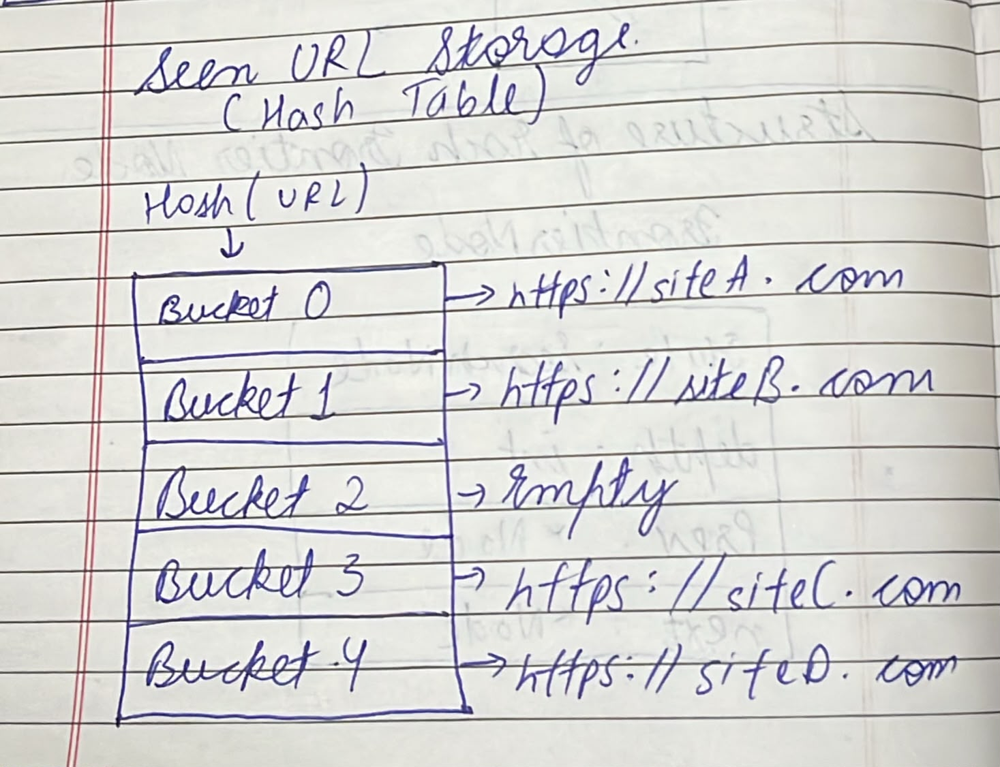
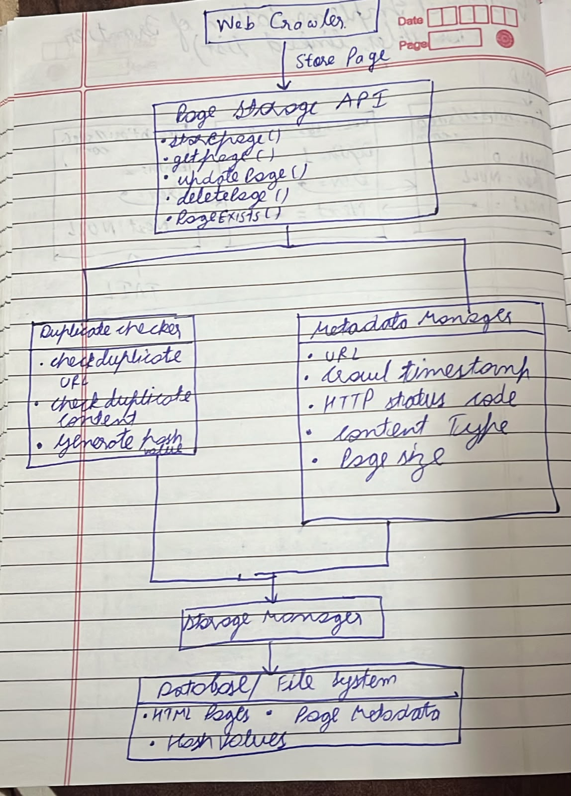
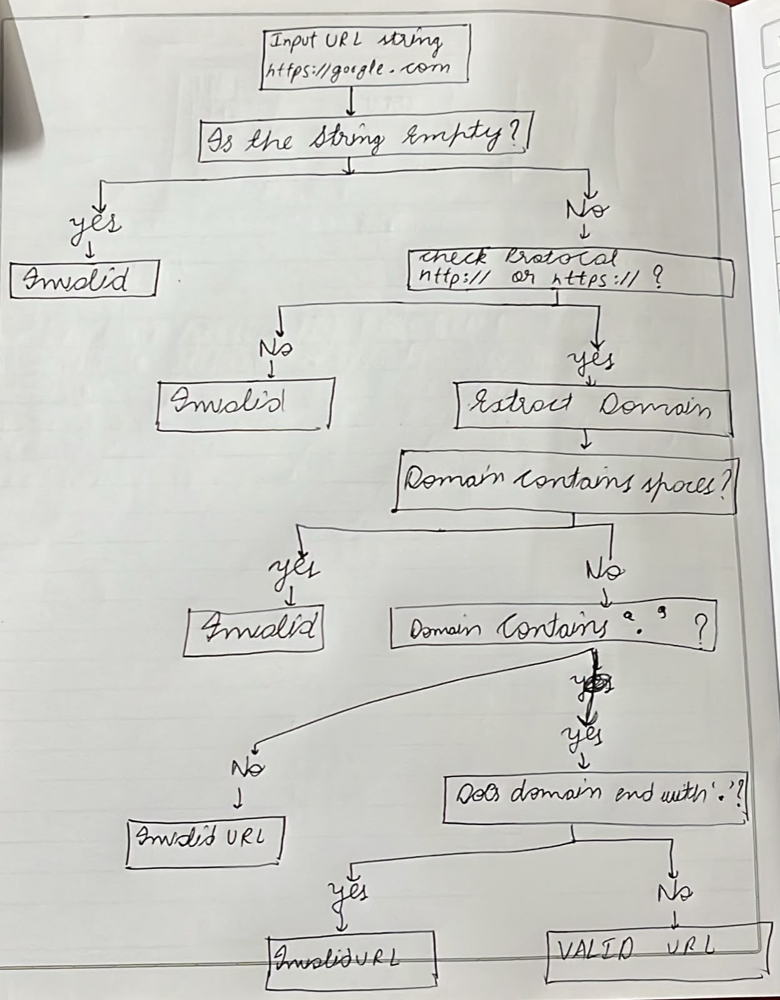
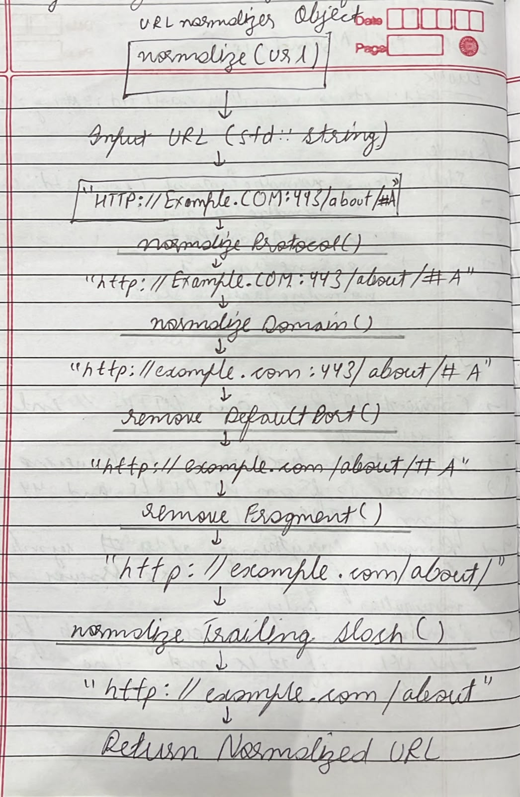

# Project 2 - Web Crawler


## Introduction

A **Web Crawler** is a software system that automatically discovers, downloads, and processes web pages by following hyperlinks. It begins with one or more **seed URLs**, fetches their content, extracts new links, validates and normalizes them, and continues this process recursively. The primary objective is to build a collection of web pages that can later be used for applications such as search engines, data mining, website analysis, and information retrieval.

This crawler is designed using a **modular architecture**, where each component is responsible for a single task. This separation of responsibilities improves maintainability, scalability, testing, and allows new features to be added without affecting existing modules.

The crawler supports both **static HTML pages** and **JavaScript-rendered pages**. Static pages are fetched using **libcurl**, while dynamically rendered pages are fetched using the **Chrome DevTools Protocol (CDP)**. A lightweight threshold-based scoring system is used to determine which fetching strategy should be applied.

---

# Main Components

## 1. URL Validator

### Purpose

The URL Validator ensures that only valid URLs enter the crawling pipeline.

### Responsibilities

- Verify that the URL is not empty.
- Validate supported protocols (`http://` and `https://`).
- Ensure that a valid domain name exists.
- Reject malformed or incomplete URLs.
- Prevent invalid URLs from entering the URL Frontier.

---

## 2. URL Frontier

### Purpose

The URL Frontier manages all URLs waiting to be crawled.

### Responsibilities

- Store discovered URLs.
- Schedule URLs using FIFO order.
- Add newly discovered URLs.
- Return the next URL for crawling.
- Track crawl depth (if required).
- Prevent duplicate scheduling.

---

## 3. URL Normalizer

### Purpose

The URL Normalizer converts different representations of the same webpage into one canonical form.

### Responsibilities

- Convert protocol and hostname to lowercase.
- Remove default ports.
- Remove URL fragments (`#fragment`).
- Normalize trailing slashes.
- Resolve relative URLs into absolute URLs.
- Produce a standardized URL before duplicate checking.

### Example

**Input**

```
HTTP://Example.com/
https://example.com:443
https://example.com/#about
```

**Normalized Output**

```
https://example.com
```

---

## 4. Seen URL Storage

### Purpose

Seen URL Storage prevents duplicate crawling.

### Responsibilities

- Store normalized URLs.
- Check whether a URL has already been discovered.
- Prevent duplicate crawling.
- Provide fast lookup using a hash-based data structure.

---

## 5. Page Storage

### Purpose

Page Storage stores downloaded webpages for future processing.

### Responsibilities

- Store webpage URL.
- Store HTML content.
- Store metadata such as:
  - HTTP status code
  - Crawl timestamp
  - Crawl depth
- Retrieve stored pages efficiently.
- Provide data for indexing and further processing.

---

## 6. Fetcher

### Purpose

The Fetcher downloads webpage content.

The crawler supports two different fetching mechanisms.

---

### Static HTML Fetcher

Used for websites whose content is directly available in the server response.

#### Technology

- libcurl

#### Advantages

- Fast execution
- Low memory usage
- High crawling throughput
- Suitable for traditional websites

---

### Rendered HTML Fetcher

Used for websites that generate content dynamically using JavaScript.

#### Technology

- Chrome DevTools Protocol (CDP)

The browser loads the webpage, executes JavaScript, waits for rendering to complete, and extracts the final DOM.

---

# Static vs Rendered HTML Detection

Before selecting the fetcher, the crawler analyzes the initial HTML response and assigns a **JavaScript Rendering Score**.

Each detected indicator contributes points toward the final score.

| Indicator | Points |
|-----------|-------:|
| Large number of `<script>` tags | +2 |
| Root application container (`#root`, `#app`) | +3 |
| Very small visible HTML body | +2 |
| React, Vue, Angular, Next.js keywords | +3 |
| Large number of empty placeholder elements | +2 |
| `<noscript>` requesting JavaScript | +2 |
| Fully populated HTML content | -3 |

---

## Threshold Decision

After calculating the total score:

| Score | Decision |
|-------:|----------|
| Less than **5** | Fetch using **libcurl** |
| Greater than or equal to **5** | Fetch using **Chrome DevTools Protocol (CDP)** |

This approach avoids launching a browser for every webpage, improving crawling speed while still supporting modern JavaScript-based websites.

---
# Overall Crawling Workflow


# Component 1 - URL Frontier

## Objective

The **URL Frontier** is responsible for managing the list of URLs that the web crawler needs to visit. Its primary objective is to organize, prioritize, and schedule URLs for crawling while ensuring that each webpage is visited efficiently and without unnecessary duplication.

The URL Frontier maintains a queue of pending URLs, adds newly discovered links from the HTML Parser, and provides the next URL to the crawler based on the crawling strategy (e.g., FIFO, priority-based, or depth-first).

By controlling the order and frequency of URL visits, the URL Frontier improves crawling efficiency, prevents repeated visits to the same webpage, and helps ensure comprehensive coverage of the target websites.

---

# Section 1 - Public API

The **Public API** defines the operations that other modules of the crawler can perform on the **URL Frontier**. It provides a simple interface for adding URLs, retrieving the next URL to crawl, inspecting the queue, and managing the frontier without exposing its internal implementation. This abstraction allows other components (such as the crawler controller and fetcher) to interact with the frontier without needing to know how the queue is implemented internally.

| Function | Parameters | Return Type | Purpose |
|----------|------------|-------------|---------|
| `addURL(const URLNode& node)` | `node : URLNode` | `void` | Adds a new URL node, containing the URL and its crawl depth, to the end of the frontier queue so it can be crawled later. |
| `getNextURL()` | None | `URLNode` | Removes and returns the URL node at the front of the queue, ensuring URLs are processed in First-In, First-Out (FIFO) order. |
| `peekNextURL()` | None | `const URLNode&` | Returns a reference to the URL node at the front of the queue without removing it, allowing the caller to inspect the next URL to be crawled. |
| `isEmpty()` | None | `bool` | Returns `true` if the frontier contains no URL nodes; otherwise returns `false`. |
| `size()` | None | `size_t` | Returns the current number of URL nodes stored in the frontier queue. |
| `clear()` | None | `void` | Removes all URL nodes from the frontier queue, leaving it empty and ready for reuse. |

### Class Definition

```cpp
class URLFrontier
{
public:
    void addURL(const URLNode& node);
    URLNode getNextURL();
    const URLNode& peekNextURL() const;
    bool isEmpty() const;
    size_t size() const;
    void clear();
};
```

---

# Section 2 - Internal Representation

.jpeg>)


A URL Frontier can be implemented as a **Doubly Linked List** or **Priority Queue**.

Each node stores:

- URL
- Depth
- Retry count
- Pointer to previous node
- Pointer to next node


# Section 3 - Failure Handling in URL Frontier

The URL Frontier is responsible for managing URLs waiting to be crawled. Although it does not perform network requests itself, it supports the crawler by handling URLs whose fetching process fails.

## Failure Scenarios

A URL may fail to be crawled due to several reasons, including:

- Network timeout
- DNS resolution failure
- Connection refused
- HTTP server errors (5xx)
- Temporary internet connectivity issues
- Browser rendering failure (CDP)

## Failure Handling Strategy

When the Fetcher reports a failure, the crawler follows these steps:

1. Remove the URL from the frontier for processing.
2. Attempt to fetch the webpage.
3. If the fetch succeeds:
   - Store the webpage.
   - Extract links.
   - Continue crawling.
4. If the fetch fails:
   - Increase the URL's retry count.
   - If the retry count is less than the maximum allowed retries, place the URL back into the frontier.
   - If the retry limit is reached, permanently discard the URL and record the failure in a log.

## Retry Policy

Each URL node stores a retry counter.

Example:

```
URL: https://example.com
Depth: 2
Retry Count: 1
```

If `Retry Count < MAX_RETRIES`

```
Reinsert into URL Frontier
```

Otherwise

```
Move to Failed URL Log
```

# Section 4 - Complexity Analysis

The **URL Frontier** is implemented using a queue based on a **Doubly Linked List**. Since the queue maintains pointers to both the front and rear nodes, most operations execute in constant time regardless of the number of URLs stored. The only exception is `clear()`, which must remove every node individually.

| Operation | Best | Average | Worst | Reason |
|-----------|------|----------|-------|--------|
| `addURL()` | **O(1)** | **O(1)** | **O(1)** | The new `URLNode` is always inserted at the rear of the queue. Since the queue maintains a direct pointer to the last node, no traversal is required. Whether the frontier contains one URL or thousands of URLs, the insertion process always performs the same fixed number of operations, so the running time remains constant. |
| `getNextURL()` | **O(1)** | **O(1)** | **O(1)** | The next URL is always removed from the front of the queue. Because the queue maintains a pointer to the front node, the operation simply updates the front pointer and removes the first node. No searching or traversal of the remaining URLs is needed, so the execution time is constant in all cases. |
| `peekNextURL()` | **O(1)** | **O(1)** | **O(1)** | This function only returns a reference to the URL node at the front of the queue without removing it. The front node is accessed directly through the front pointer, making the operation independent of the number of URLs stored in the frontier. |
| `isEmpty()` | **O(1)** | **O(1)** | **O(1)** | The function simply checks whether the queue contains any nodes, usually by testing whether the front pointer is `nullptr` or whether the stored size is zero. Since it performs only a single comparison, the execution time is always constant. |
| `size()` | **O(1)** | **O(1)** | **O(1)** | The queue maintains the current number of stored URL nodes in a dedicated member variable that is updated whenever a URL is added or removed. Therefore, determining the size only requires returning this stored value instead of counting every node in the queue. |
| `clear()` | **O(n)** | **O(n)** | **O(n)** | To completely empty the frontier, every URL node must be removed and its memory released. Since each of the **n** nodes is processed exactly once, the running time grows linearly with the number of stored URLs. Regardless of the queue's contents, all nodes must be visited before the frontier becomes empty. |

---

## Summary

- **Constant Time (O(1))**
  - `addURL()`
  - `getNextURL()`
  - `peekNextURL()`
  - `isEmpty()`
  - `size()`

  These operations access either the **front pointer**, **rear pointer**, or the maintained **size variable** directly. They never traverse the queue, so their execution time does not depend on the number of URLs stored.

- **Linear Time (O(n))**
  - `clear()`

  This operation must remove every URL node individually. As the number of stored URLs increases, the time required increases proportionally, resulting in **O(n)** complexity.

# Section 5 - Future Compatibility with Project 03 (Indexer)

The **URL Frontier** is designed to remain compatible with the future **Indexer** project. The Indexer does not directly modify or consume URLs from the frontier. Instead, the URL Frontier participates in the crawler pipeline by supplying URLs that eventually become stored webpages for the Indexer.

The interaction flow is:

```text
URL Frontier
     |
     | getNextURL()
     v
   Fetcher
     |
     | Fetch webpage content
     v
 Page Storage
     |
     | Store crawled page
     v
   Indexer
```

The URL Frontier methods interact with the future Indexer indirectly as follows:

| URL Frontier Method           | Interaction with the Indexer                                                                                                                                                                                                                   |
| ----------------------------- | ---------------------------------------------------------------------------------------------------------------------------------------------------------------------------------------------------------------------------------------------- |
| `addURL(const URLNode& node)` | Adds newly discovered URLs to the crawling queue. These URLs may later be fetched, stored in Page Storage, and eventually processed by the Indexer.                                                                                            |
| `getNextURL()`                | Provides the next URL to the crawler. After the webpage is successfully fetched and stored, its content becomes available for indexing.                                                                                                        |
| `peekNextURL()`               | Allows the crawler controller to inspect the next URL before processing it. This can support future scheduling or prioritization strategies without affecting the Indexer's workflow.                                                          |
| `isEmpty()`                   | Indicates whether any URLs are still waiting to be crawled. When the frontier becomes empty, the crawler has no remaining scheduled pages, helping determine when the crawling phase is complete and indexing can proceed on all stored pages. |
| `size()`                      | Returns the number of URLs still waiting to be crawled. This can be used to monitor crawling progress before or during the indexing pipeline.                                                                                                  |
| `clear()`                     | Removes all pending URLs from the frontier. This may be used when resetting or restarting a crawl before generating a new collection of pages for indexing.                                                                                    |

## Interaction with the Indexer

The URL Frontier and Indexer remain separate components with different responsibilities:

* The **URL Frontier** manages which URLs should be crawled.
* The **Fetcher** downloads the webpage content.
* The **Page Storage** stores successfully crawled webpages.
* The **Indexer** reads stored webpages and builds the inverted index.

For example:

```cpp
while (!frontier.isEmpty())
{
    URLNode node = frontier.getNextURL();

    FetchResult result = fetcher.fetch(node.url);

    if (result.success)
    {
        pageStorage.storePage(node.url, result.html, node.depth);
    }
}
```

After pages have been stored, the future Indexer can process them:

```cpp
for (int id = 0; id < pageStorage.pageCount(); id++)
{
    std::string url = pageStorage.getURLByID(id);
    std::string html = pageStorage.getPage(url);

    // Parse the stored page
    // Extract words
    // Build the inverted index
}
```

This design keeps the **URL Frontier independent from the Indexer** while still supporting the complete pipeline:

```text
URL Scheduling → Crawling → Page Storage → Indexing
```

Because the components communicate through clearly defined public APIs, the Indexer can be added in Project 03 without requiring major changes to the existing URL Frontier implementation.


# Component 2 - Seen Storage

## Objective

The **Seen Storage** is responsible for ensuring that each URL is discovered only once during the crawling process. Its primary objective is to prevent duplicate URL discovery, avoid infinite crawling loops, and improve the overall efficiency of the web crawler.

Whenever the HTML Parser discovers a new URL, the crawler first checks the Seen Storage. If the URL has not been seen before, it is added to both the Seen Storage and the URL Frontier. Otherwise, the URL is ignored.

---

# Section 1 – Public API

The **Seen Storage** module provides a minimal set of operations required to maintain the collection of previously discovered URLs. Its primary responsibility is to prevent duplicate URLs from being scheduled for crawling, thereby ensuring that each unique web page is processed only once.

| Method | Parameters | Return Type | Purpose |
|---------|------------|-------------|---------|
| **`addSeenURL(url)`** | `url : String` | `bool` | Inserts a normalized URL into the Seen Storage if it does not already exist. Returns `true` when the URL is successfully inserted and `false` if the URL has already been recorded, preventing duplicate entries from being added to the crawler pipeline. |
| **`isSeen(url)`** | `url : String` | `bool` | Determines whether the specified URL is already present in the Seen Storage. This method is invoked before scheduling a URL for crawling to ensure that previously discovered pages are not processed multiple times. |
| **`removeSeenURL(url)`** *(Optional)* | `url : String` | `bool` | Removes the specified URL from the Seen Storage if it exists. Although not required during normal crawling, this operation supports testing, storage maintenance, debugging, and future features such as URL expiration or recrawling policies. |
| **`seenCount()`** | None | `int` | Returns the total number of unique URLs currently maintained by the Seen Storage. This information can be used to monitor crawler progress, generate runtime statistics, and validate the correctness of storage operations. |
| **`clearSeenStorage()`** | None | `void` | Removes every stored URL from the Seen Storage and releases all associated resources, restoring the storage to its initial empty state. This operation is typically performed when resetting the crawler or performing application cleanup before termination. |

### Class Definition

```cpp
class SeenStorage
{
public:
    bool addSeenURL(string url);
    bool isSeen(string url);
    bool removeSeenURL(string url);
    int seenCount();
    void clearSeenStorage();
};
```

---

# Section 2 - Internal Implementation



### Internal Data Structure

- Hash Set (`unordered_set<string>`)
- Stores only unique URLs.
- Duplicate URLs are automatically rejected.
- Supports constant-time lookup on average.

Workflow:

```text
New URL
    │
    ▼
isSeen(URL)?
    │
 ┌──┴──────┐
 │         │
Yes        No
 │          │
Ignore   addSeenURL()
            │
            ▼
      Add to Frontier
```

---

# Section 3 - Failure Handling

Seen Storage must handle several exceptional situations while recording discovered URLs.

| Failure | Handling |
|---------|----------|
| **Invalid URLs** | Validate the URL before storing it. Reject malformed URLs or unsupported schemes such as `ftp://`, `mailto:`, or `javascript:`. |
| **Duplicate URLs** | Check `isSeen(url)` before insertion. If the URL already exists, ignore it and return `false`. |
| **Hash Collision** | Resolve collisions using the hash table implementation (separate chaining or open addressing). Unique URLs remain accessible. |
| **Empty URL** | Reject empty strings or URLs containing only whitespace. |
| **Memory Limit** | If storage reaches its limit, report the failure gracefully, log the error, and continue processing existing URLs. |

---

## Examples

### Invalid URL

```text
https://example.com/page1     ✓ Added

javascript:void(0)            ✗ Ignored

htp://example.com             ✗ Invalid
```

---

### Duplicate URL

```text
Seen Storage

https://example.com

New URL

https://example.com

Result

Duplicate → Not Stored
```

---

### Empty URL

```text
URL

""

Result

Rejected
```

---

# Section 4 – Complexity Analysis

| Method | Best Case | Average Case | Worst Case | Purpose |
|--------|-----------|--------------|------------|---------|
| **`addSeenURL()`** | **O(1)** | **O(1)** | **O(n)** | Inserts a normalized URL into the hash map only if it has not been encountered before. The operation computes the hash of the URL, locates the corresponding bucket, and stores the entry while preventing duplicates. Maintaining constant-time insertion enables the crawler to efficiently process millions of URLs without repeatedly visiting the same page. |
| **`isSeen()`** | **O(1)** | **O(1)** | **O(n)** | Determines whether a URL already exists in the hash map before it is scheduled for crawling. Efficient lookup prevents duplicate URLs from entering the URL Frontier, reducing unnecessary network requests and improving the overall efficiency of the crawler. |
| **`removeSeenURL()`** | **O(1)** | **O(1)** | **O(n)** | Removes a URL from the hash map by locating its corresponding bucket and deleting the stored entry. Although rarely used during normal crawling, this operation supports storage maintenance, testing, debugging, and future enhancements such as URL expiration or recrawling policies. |
| **`seenCount()`** | **O(1)** | **O(1)** | **O(1)** | Returns the total number of unique URLs currently stored by accessing an internally maintained counter. Since no traversal of the hash map is required, the execution time remains constant regardless of the number of stored URLs. This information is useful for monitoring crawler progress and collecting runtime statistics. |
| **`clearSeenStorage()`** | **O(n)** | **O(n)** | **O(n)** | Clears the entire hash map by removing every stored URL and releasing all associated memory. Each entry must be visited exactly once during cleanup, making the running time proportional to the total number of stored URLs. This operation is typically performed when resetting the crawler or releasing resources before program termination. |

### Complexity Justification

- **Best Case – O(1):** The hash function maps the URL directly to its bucket with no collisions, allowing insertion, lookup, or deletion to complete in constant time.

- **Average Case – O(1):** Assuming a well-designed hash function and a balanced distribution of keys across buckets, hash map operations require only a constant number of comparisons on average, even as the number of stored URLs grows.

- **Worst Case – O(n):** If many URLs hash to the same bucket due to excessive collisions or poor hash distribution, the bucket may need to be traversed linearly, causing insertion, lookup, or deletion to degrade to **O(n)**.

- **`seenCount()`** remains **O(1)** because the total number of stored URLs is maintained as an internal member variable rather than being calculated by traversing the hash map.

- **`clearSeenStorage()`** is **O(n)** in all cases because every stored entry must be removed and its allocated memory released exactly once.
---

# Section 5 - Future Compatibility with Project 03 (Indexer)

The **Seen Storage** is primarily a crawler-side component, so the future **Indexer does not directly call its methods**. However, its methods indirectly affect the quality and efficiency of the indexing process by preventing duplicate URLs from entering the crawling pipeline.

The interaction flow is:

```text
HTML Parser
     |
     | Extract URLs
     v
Seen Storage
     |
     | Unique URLs only
     v
URL Frontier
     |
     | Schedule URLs
     v
Fetcher
     |
     | Fetch webpage
     v
Page Storage
     |
     | Stored pages
     v
Indexer
```

The Seen Storage methods interact with the future Indexer indirectly as follows:

| Seen Storage Method               | Interaction with the Future Indexer                                                                                                                                                                                       |
| --------------------------------- | ------------------------------------------------------------------------------------------------------------------------------------------------------------------------------------------------------------------------- |
| `addSeenURL(url)`                 | Records a newly discovered normalized URL so that it enters the crawling pipeline only once. This reduces the possibility of duplicate webpages being fetched and later processed by the Indexer.                         |
| `isSeen(url)`                     | Checks whether a URL has already been discovered before it is added to the URL Frontier. By filtering duplicate URLs early, it helps ensure that the Indexer receives a cleaner collection of stored webpages.            |
| `removeSeenURL(url)` *(Optional)* | Allows a URL to be removed from Seen Storage, making future rediscovery or recrawling possible. If the page is fetched and stored again, the updated content may later be processed by a future re-indexing mechanism.    |
| `seenCount()`                     | Provides the number of unique URLs discovered during crawling. This value can be used as a crawler statistic and may help compare the number of discovered URLs with the number of successfully stored and indexed pages. |
| `clearSeenStorage()`              | Resets the collection of discovered URLs before a new crawling session. This allows the crawler to build a fresh collection of pages that can later be processed by the Indexer.                                          |

## Indirect Interaction with the Indexer

The Indexer does not need direct access to the Seen Storage. Instead, the Seen Storage improves the input that eventually reaches the Indexer.

For example:

```cpp
if (!seenStorage.isSeen(normalizedURL))
{
    seenStorage.addSeenURL(normalizedURL);
    frontier.addURL(URLNode(normalizedURL, depth));
}
```

The URL is then processed by the crawler:

```cpp
URLNode node = frontier.getNextURL();

FetchResult result = fetcher.fetch(node.url);

if (result.success)
{
    pageStorage.storePage(node.url, result.html, node.depth);
}
```

Later, the future Indexer processes the successfully stored pages:

```cpp
for (int id = 0; id < pageStorage.pageCount(); id++)
{
    std::string url = pageStorage.getURLByID(id);
    std::string html = pageStorage.getPage(url);

    // Parse page content
    // Extract words
    // Build the inverted index
}
```

Therefore, the complete relationship is:

```text
Seen Storage
     |
     | Prevents duplicate URL discovery
     v
URL Frontier
     |
     | Schedules unique URLs
     v
Fetcher
     |
     | Downloads pages
     v
Page Storage
     |
     | Provides stored pages
     v
Indexer
```

The **Seen Storage and Indexer remain independent components**. The Indexer does not directly invoke Seen Storage methods, but Seen Storage supports the future indexing process by ensuring that duplicate URLs are filtered before they can produce unnecessary duplicate crawling and indexing work.

# Component 3 - Page Storage

## Objective

The **Page Storage** module is responsible for efficiently storing all web pages collected by the crawler in a structured and organized manner.

It maintains the HTML content together with important metadata such as the page URL, crawl timestamp, HTTP status code, content type, and crawl status. The module eliminates duplicate pages to ensure efficient use of storage space while enabling fast retrieval of stored pages for indexing, searching, and further analysis.

The Page Storage module is also designed to support future scalability for handling large collections of crawled web pages.

---

# Section 1 - Public API

| Method                            | Parameters                                                                 | Return Type   | Purpose                                                                                                                                                                                                                                                                                                                                                                        |
| --------------------------------- | -------------------------------------------------------------------------- | ------------- | ------------------------------------------------------------------------------------------------------------------------------------------------------------------------------------------------------------------------------------------------------------------------------------------------------------------------------------------------------------------------------ |
| **`storePage(url, html, depth)`** | `url : const std::string&`<br>`html : const std::string&`<br>`depth : int` | `bool`        | Stores a crawled webpage in the `pages` table together with its normalized URL, HTML content, and crawl depth. If the URL already exists, the existing HTML content and depth are updated instead of creating a duplicate record. The method returns `true` when the database operation succeeds and `false` when the page cannot be stored.                                   |
| **`getPage(url)`**                | `url : const std::string&`                                                 | `std::string` | Retrieves the complete HTML content associated with the specified URL from Page Storage. This allows other components, especially the future Indexer, to access previously crawled webpage content without downloading the page again. If the URL does not exist or the database operation fails, an empty string is returned.                                                 |
| **`hasPage(url)`**                | `url : const std::string&`                                                 | `bool`        | Checks whether a webpage with the specified URL already exists in Page Storage. This operation can be used to verify successful storage and prevent unnecessary database operations. It returns `true` when a matching page exists and `false` when no matching record is found or the database query fails.                                                                   |
| **`pageCount()`**                 | None                                                                       | `int`         | Returns the total number of webpages currently stored in the `pages` table. This method can be used to monitor crawling progress, generate storage statistics, and determine how many pages are available for future processing by components such as the Indexer. A value of `-1` is returned if the database query fails.                                                    |
| **`removePage(url)`**             | `url : const std::string&`                                                 | `bool`        | Removes the webpage associated with the specified URL from Page Storage. The method can be used for storage maintenance, testing, cleanup, or removing pages that should no longer be available for future indexing. It returns `true` only when an existing database record is successfully deleted and `false` when no matching page exists or the deletion operation fails. |
| **`clear()`**                     | None                                                                       | `void`        | Removes all stored webpages from the `pages` table, resetting Page Storage to an empty state. This operation is useful when starting a completely new crawling session, performing testing, or clearing previously collected data before rebuilding the stored webpage collection.                                                                                             |
---

## Class Definition

```cpp
class PageStorage
{
public:
    bool storePage(const std::string& url,
                   const std::string& html,
                   int depth);

    std::string getPage(const std::string& url);

    bool hasPage(const std::string& url);

    int pageCount();

    bool removePage(const std::string& url);

    void clear();
};
```

---

# Section 2 - Internal Implementation


---

## Workflow

1. The **Web Crawler** downloads a webpage.
2. The downloaded page is sent to the **Page Storage API**.
3. The **Duplicate Checker** verifies whether the page has already been stored.
4. The **Metadata Manager** extracts metadata including:
   - URL
   - Crawl timestamp
   - HTTP status code
   - Content type
   - Crawl depth
5. The **Storage Manager** stores both the HTML content and metadata.
6. The **Database/File System** persistently stores the page for later retrieval, indexing, and analysis.

---

## Internal Representation

Each stored page consists of two parts:

### HTML Content

```text
URL

↓

HTML Document
```

### Metadata

```text
URL

Crawl Timestamp

Status Code

Content Type

Depth

Content Length
```

Example:

```text
Page

URL:
https://example.com

HTML:
<html>...</html>

Metadata

Timestamp:
2026-07-04 10:20:30

Status:
200 OK

Content-Type:
text/html

Depth:
2
```

---

# Section 3 - Failure Handling and Edge Cases

The **Page Storage** component must handle database failures, invalid input, duplicate pages, and unexpected webpage content without crashing the crawler. Since Page Storage is responsible for persistent storage, failures should be detected and reported to the crawler so that appropriate actions such as logging, retrying, or skipping the page can be performed.

| Failure / Edge Case                           | Handling Strategy                                                                                                                                                                                                                                                                                                                   |
| --------------------------------------------- | ----------------------------------------------------------------------------------------------------------------------------------------------------------------------------------------------------------------------------------------------------------------------------------------------------------------------------------- |
| **MySQL Initialization Failure**              | If `mysql_init()` fails while creating the database connection object, the `PageStorage` constructor throws a `std::runtime_error`. The component is not created because database operations cannot be performed without a valid MySQL connection.                                                                                  |
| **Missing Database Password**                 | The database password is obtained from the `CRAWLER_DB_PASSWORD` environment variable. If the variable is not set, the partially initialized MySQL connection is closed and the constructor throws a `std::runtime_error`, preventing the application from continuing with invalid credentials.                                     |
| **Database Connection Failure**               | If `mysql_real_connect()` fails because of incorrect credentials, an unavailable MySQL server, an invalid database name, or another connection problem, the connection is closed and a `std::runtime_error` containing the MySQL error message is thrown.                                                                           |
| **Prepared Statement Initialization Failure** | If `mysql_stmt_init()` fails, methods such as `storePage()`, `getPage()`, `hasPage()`, and `removePage()` return their failure value without attempting further database operations.                                                                                                                                                |
| **SQL Statement Preparation Failure**         | If `mysql_stmt_prepare()` fails because of an invalid query or database schema problem, the prepared statement is closed to prevent resource leakage and the method returns an appropriate failure value.                                                                                                                           |
| **Parameter Binding Failure**                 | If input parameters cannot be bound to a prepared statement, the statement is closed and the operation is terminated. Prepared statements are used to safely handle URLs and HTML content containing special characters.                                                                                                            |
| **Duplicate URL**                             | The `url` column is expected to have a unique constraint. When `storePage()` receives an existing URL, `ON DUPLICATE KEY UPDATE` updates the stored HTML, crawl depth, and `crawled_at` timestamp instead of creating a duplicate database record.                                                                                  |
| **Empty URL**                                 | An empty URL should be rejected before calling `storePage()`, because it does not identify a valid webpage. URL validation is primarily the responsibility of the URL Validator, but Page Storage may also perform an additional defensive check if required.                                                                       |
| **Empty HTML Content**                        | A page may legitimately contain an empty response body. The current implementation can store empty HTML, but `getPage()` also returns an empty string when a page is missing or retrieval fails. Therefore, `hasPage()` should be used when it is necessary to distinguish an existing page with empty content from a missing page. |
| **Very Large HTML Content**                   | HTML is bound using `MYSQL_TYPE_LONG_BLOB`, allowing large webpage content to be stored. However, storage may still fail if the content exceeds MySQL configuration limits, available database storage, or packet-size restrictions. In such cases, `storePage()` returns `false`.                                                  |
| **Special Characters or Binary Data in HTML** | HTML may contain quotes, Unicode characters, null bytes, or other special data. Prepared statements and explicit content lengths are used so that the content is handled safely without manually constructing SQL queries.                                                                                                          |
| **Page Not Found During Retrieval**           | If `getPage()` cannot find a matching URL, it returns an empty string. The caller can use `hasPage()` when it needs to determine whether the page actually exists.                                                                                                                                                                  |
| **Page Not Found During Deletion**            | If `removePage()` executes successfully but no row matches the specified URL, `mysql_stmt_affected_rows()` returns zero and the method returns `false`, indicating that no stored page was removed.                                                                                                                                 |
| **Database Query Execution Failure**          | If statement execution fails because of a lost connection, database error, or server problem, the operation is terminated, allocated statement resources are released, and the method returns its defined failure value.                                                                                                            |
| **Page Count Query Failure**                  | If the `COUNT(*)` query fails, the result cannot be retrieved, or no result row is returned, `pageCount()` returns `-1`. This distinguishes a database failure from a valid page count of `0`.                                                                                                                                      |
| **Clear Operation Failure**                   | The current `clear()` method returns `void`, so a failure of `DELETE FROM pages` is not reported to the caller. A future implementation may return `bool` or log the MySQL error so that cleanup failures can be detected.                                                                                                          |
| **Resource Cleanup**                          | Every prepared statement and query result is explicitly released after use. The destructor closes the MySQL connection if it is valid, preventing database connection and resource leaks.                                                                                                                                           |

## Failure Return Values

The Page Storage API uses the following values to indicate unsuccessful operations:

| Method         | Failure Result                                     |
| -------------- | -------------------------------------------------- |
| `storePage()`  | Returns `false`                                    |
| `getPage()`    | Returns an empty string `""`                       |
| `hasPage()`    | Returns `false`                                    |
| `pageCount()`  | Returns `-1`                                       |
| `removePage()` | Returns `false`                                    |
| `clear()`      | No failure value because the return type is `void` |

This failure-handling strategy allows the crawler to continue operating when individual storage operations fail while treating critical initialization and database connection failures as exceptions that prevent Page Storage from being created.

---

# Section 4 - Complexity Analysis

The **Page Storage** component uses a MySQL database to persist crawled webpages. The `url` column is expected to have a **UNIQUE index**, allowing MySQL to locate pages efficiently. Therefore, operations that search by URL generally have **O(log n)** complexity when MySQL uses its typical B-tree index structure.

Here, **n** represents the total number of pages stored in the `pages` table.

| Method             | Best Case    | Average Case | Worst Case | Purpose                                                                                                                                                                                                                                                                                                                                                                                                            |
| ------------------ | ------------ | ------------ | ---------- | ------------------------------------------------------------------------------------------------------------------------------------------------------------------------------------------------------------------------------------------------------------------------------------------------------------------------------------------------------------------------------------------------------------------ |
| **`storePage()`**  | **O(log n)** | **O(log n)** | **O(n)**   | Stores a new webpage or updates an existing page when the URL already exists. MySQL must check the unique index on the `url` column before inserting the record. Indexed lookup generally requires **O(log n)** time, while the worst case may degrade because of database overhead, index maintenance, or storage-related conditions. The actual cost also depends on the size of the HTML content being written. |
| **`getPage()`**    | **O(log n)** | **O(log n)** | **O(n)**   | Retrieves the HTML content associated with a specific URL. Since the query searches using the indexed `url` column, MySQL can locate the corresponding row efficiently without scanning the entire table. The operation may degrade to **O(n)** if the required index is unavailable or a full table scan occurs. Returning the HTML also requires time proportional to the size of the stored HTML content.       |
| **`hasPage()`**    | **O(log n)** | **O(log n)** | **O(n)**   | Checks whether a page exists by executing `SELECT 1 FROM pages WHERE url = ? LIMIT 1`. The indexed URL allows MySQL to locate the record efficiently. Without an effective index, the database may need to scan multiple or all stored rows, resulting in linear time.                                                                                                                                             |
| **`pageCount()`**  | **O(1)**     | **O(1)**     | **O(n)**   | Executes `SELECT COUNT(*) FROM pages` to determine the total number of stored pages. The exact complexity depends on the MySQL storage engine and database implementation. The operation may be optimized in some cases, but it can require scanning rows or index entries, resulting in **O(n)** in the worst case.                                                                                               |
| **`removePage()`** | **O(log n)** | **O(log n)** | **O(n)**   | Removes the page associated with a specific URL. MySQL first locates the row through the URL index and then deletes the record while updating the relevant indexes. Indexed lookup generally takes **O(log n)**, while a missing or ineffective index may require a linear scan.                                                                                                                                   |
| **`clear()`**      | **O(n)**     | **O(n)**     | **O(n)**   | Executes `DELETE FROM pages`, which removes every stored page from the table. Since all **n** records must be deleted and associated database resources and indexes must be updated, the execution time grows linearly with the number of stored pages.                                                                                                                                                            |

## Complexity Justification

* **Indexed URL Operations – O(log n):**
  `storePage()`, `getPage()`, `hasPage()`, and `removePage()` operate using the `url` column. With a UNIQUE B-tree index on this column, MySQL can locate the required record in approximately **O(log n)** time.

* **Worst Case – O(n):**
  If the database cannot use the URL index, a full table scan may be required. In this situation, MySQL may inspect up to all **n** stored records.

* **HTML Content Size – O(h):**
  For `storePage()` and `getPage()`, the size of the HTML content also affects execution time. If **h** represents the number of bytes in the HTML document, storing or retrieving the content requires approximately **O(h)** additional work. Therefore, a more precise complexity can be expressed as **O(log n + h)**.

* **`pageCount()` – Database Dependent:**
  The performance of `COUNT(*)` depends on the MySQL storage engine and query execution strategy. It may be optimized in some situations, but a complete scan can require **O(n)** time.

* **`clear()` – O(n):**
  The current implementation uses `DELETE FROM pages`, which removes stored rows and updates database structures. Therefore, its complexity is considered **O(n)**.

## Summary

* **Indexed operations:** `storePage()`, `getPage()`, `hasPage()`, and `removePage()` generally operate in **O(log n)** time.
* **Content transfer:** `storePage()` and `getPage()` additionally depend on HTML size, giving a more precise complexity of **O(log n + h)**.
* **Full-storage operation:** `clear()` requires **O(n)** time.
* **Database-dependent operation:** `pageCount()` may range from an optimized operation to **O(n)** depending on the storage engine and execution strategy.


---

# Section 5 - Future Compatibility with Project 03 (Indexer)

The **Page Storage** component will act as the primary connection between the current **Web Crawler** and the future **Indexer (Project 03)**. Unlike the URL Frontier and Seen Storage, which interact with the Indexer only indirectly, Page Storage will provide the actual webpage content that the Indexer needs to process.

The crawler stores successfully downloaded webpages in Page Storage. The future Indexer can then retrieve these stored pages, extract textual content, tokenize words, calculate term frequencies, and build an inverted index for keyword searching.

The interaction flow is:

```text id="x4xgzq"
Web Crawler
     |
     | storePage()
     v
Page Storage
     |
     | Stored URL + HTML + Depth
     v
MySQL Database
     |
     | Retrieve stored pages
     v
Future Indexer
     |
     | Parse and tokenize content
     v
Inverted Index
```

## Interaction of Page Storage Methods with the Future Indexer

| Page Storage Method           | Interaction with the Future Indexer                                                                                                                                                                                                                                           |
| ----------------------------- | ----------------------------------------------------------------------------------------------------------------------------------------------------------------------------------------------------------------------------------------------------------------------------- |
| `storePage(url, html, depth)` | Stores the URL, downloaded HTML content, and crawl depth of a successfully fetched webpage. Although this method is primarily called by the crawler, it creates the persistent collection of documents that will later serve as the input dataset for the Indexer.            |
| `getPage(url)`                | Retrieves the complete stored HTML content of a webpage using its URL. The future Indexer can use this method to obtain the page content, remove HTML tags, extract visible text, tokenize words, and generate index entries.                                                 |
| `hasPage(url)`                | Checks whether a webpage exists in Page Storage. The Indexer can use this method before requesting a page to verify that the document is available and avoid attempting to process a missing record.                                                                          |
| `pageCount()`                 | Returns the total number of webpages stored by the crawler. The Indexer can use this value to monitor the number of available documents, calculate indexing progress, and determine the size of the crawled document collection.                                              |
| `removePage(url)`             | Removes a stored webpage from Page Storage. If a page is deleted before indexing, it will no longer be available to the Indexer. In a future integrated system, removing an already indexed page may also require removing its corresponding entries from the inverted index. |
| `clear()`                     | Removes all stored webpages from Page Storage. When the stored document collection is cleared, the existing index may also need to be cleared or rebuilt because its indexed documents would no longer correspond to the pages available in storage.                          |

## Example Interaction with the Future Indexer

The crawler first stores successfully downloaded webpages:

```cpp id="40g9gu"
FetchResult result = fetcher.fetch(node.url);

if (result.success)
{
    pageStorage.storePage(
        node.url,
        result.html,
        node.depth
    );
}
```

The future Indexer can then retrieve a stored page:

```cpp id="42y0u8"
if (pageStorage.hasPage(url))
{
    std::string html = pageStorage.getPage(url);

    // Remove HTML tags
    // Extract visible text
    // Tokenize words
    // Calculate term frequencies
    // Add terms to the inverted index
}
```

The `pageCount()` method can also be used to monitor indexing progress:

```cpp id="2a4yru"
int totalPages = pageStorage.pageCount();

// Use totalPages to track the number
// of documents available for indexing.
```

## Future API Extension for Sequential Indexing

The current Page Storage API retrieves pages using their URLs. For Project 03, an additional method such as `getURLByID(int id)` or `getAllPages()` may be added so that the Indexer can iterate through every stored webpage without already knowing its URL.

For example:

```cpp id="2gtizn"
for (int id = 1; id <= pageStorage.pageCount(); id++)
{
    std::string url = pageStorage.getURLByID(id);
    std::string html = pageStorage.getPage(url);

    // Extract text
    // Tokenize words
    // Build inverted index
}
```

The possible future method would be:

```cpp id="o42a1x"
std::string getURLByID(int id);
```

This method would allow the Indexer to retrieve URLs sequentially using the unique page IDs assigned by the database.

## Relationship with the Web Crawler and Indexer

```text id="kx9rx1"
Fetcher
    |
    | Downloaded HTML
    v
Page Storage
    |
    | storePage()
    v
MySQL Database
    |
    +-----------------------+
    |                       |
    | getPage()             | pageCount()
    | hasPage()             | Future: getURLByID()
    v                       v
           Future Indexer
                 |
                 | Extract text and words
                 v
           Inverted Index
                 |
                 v
          Keyword Searching
```

The **Page Storage component serves as the persistent data bridge between the Web Crawler and the future Indexer**. The crawler is responsible for collecting and storing webpages, while the Indexer is responsible for reading those stored webpages and transforming their content into a searchable inverted index.

Because both components interact through the Page Storage public API, the future Indexer can be integrated without requiring major changes to the crawler's internal implementation.

# Component 4 - HTML parser

## objective 

The objective of the HTML Parser module is to analyze the downloaded HTML content of a webpage, convert it into a structured format, and extract useful information such as page titles, headings, paragraphs, hyperlinks, images, and metadata. This structured data enables the web crawler to discover new URLs for further crawling and store relevant webpage content for indexing, analysis, or search.

# Section 1 - Public API

The **HTML Parser** component is responsible for analyzing the HTML content downloaded by the Fetcher and extracting hyperlinks that can be processed by the crawler. It identifies anchor (`<a>`) elements, extracts their `href` values, filters unsupported or non-crawlable links, and converts relative URLs into absolute URLs using the webpage's base URL.

The extracted URLs can then be passed through the remaining crawler pipeline, including the **URL Validator**, **URL Normalizer**, **Seen Storage**, and **URL Frontier**.

| Method                               | Parameters                                                    | Return Type                | Purpose                                                                                                                                                                                                                                                                                                                                                                                                                                                                                                     |
| ------------------------------------ | ------------------------------------------------------------- | -------------------------- | ----------------------------------------------------------------------------------------------------------------------------------------------------------------------------------------------------------------------------------------------------------------------------------------------------------------------------------------------------------------------------------------------------------------------------------------------------------------------------------------------------------- |
| **`extractLinks(html, baseURL)`**    | `html : const std::string&`<br>`baseURL : const std::string&` | `std::vector<std::string>` | Extracts hyperlinks from the supplied HTML document. The method searches for valid `<a>` tags and identifies their `href` attributes in a case-insensitive manner. It supports double-quoted, single-quoted, and unquoted `href` values. Links such as page fragments, JavaScript actions, email addresses, and telephone links are ignored. Valid relative links are converted into absolute URLs using the provided `baseURL`, and the resulting collection of crawlable URLs is returned to the crawler. |
| **`isIgnoredLink(link)`**            | `link : const std::string&`                                   | `bool`                     | Determines whether an extracted link should be excluded from the crawling pipeline. The method rejects empty links, fragment-only references beginning with `#`, JavaScript links using `javascript:`, email links using `mailto:`, and telephone links using `tel:`. It returns `true` when the link should be ignored and `false` when the link can continue through URL resolution and subsequent crawler processing.                                                                                    |
| **`makeAbsoluteURL(link, baseURL)`** | `link : const std::string&`<br>`baseURL : const std::string&` | `std::string`              | Converts a discovered link into an absolute URL that can be processed by the crawler. The method preserves URLs that are already absolute and resolves protocol-relative URLs, root-relative paths, current-directory paths, normal relative paths, and parent-directory paths such as `../` and `../../`. The provided `baseURL` is used to determine the protocol, origin, and current directory required to construct the final URL.                                                                     |

### Class Definition

class HTMLParser
{
public:
    HTMLParser();

    std::vector<std::string> extractLinks(
        const std::string& html,
        const std::string& baseURL
    );

private:
    bool isIgnoredLink(
        const std::string& link
    );

    std::string makeAbsoluteURL(
        const std::string& link,
        const std::string& baseURL
    );
};
```

# Section 2 - Internal Implementation

The **HTML Parser** uses a lightweight string-processing approach to extract hyperlinks from an HTML document without constructing a complete **Document Object Model (DOM)**. The parser works directly on the raw HTML string and uses the **Knuth-Morris-Pratt (KMP) string-searching algorithm** to efficiently locate anchor (`<a>`) tags and `href` attributes.

The parser first creates a lowercase copy of the HTML document so that HTML tags can be searched in a case-insensitive manner while preserving the original HTML content for URL extraction. Each valid anchor tag is inspected individually, and its `href` value is extracted, filtered, and converted into an absolute URL when necessary.

---

## Processing Steps

1. Receive the raw HTML document and the webpage's base URL.

2. Create a lowercase copy of the HTML document to support case-insensitive searching without modifying the original HTML.

3. Use the **KMP search algorithm** to locate all occurrences of `<a` in the HTML document.

4. Verify that each `<a` occurrence represents a valid anchor tag by checking the character immediately following `a`.

5. Locate the closing `>` character of the anchor tag.

6. Extract the complete anchor tag from the original HTML document.

7. Create a lowercase copy of the extracted tag and use KMP to search for the `href` attribute.

8. Verify that the detected `href` is a valid attribute and is properly separated from other attribute names.

9. Skip whitespace between `href`, the assignment operator (`=`), and the attribute value.

10. Extract the URL from the `href` attribute. The parser supports:

    * Double-quoted values: `href="page.html"`
    * Single-quoted values: `href='page.html'`
    * Unquoted values: `href=page.html`

11. Pass the extracted link to `isIgnoredLink()` to reject non-crawlable links such as:

    * Empty links
    * Fragment links beginning with `#`
    * `javascript:` links
    * `mailto:` links
    * `tel:` links

12. Pass valid links to `makeAbsoluteURL()` to resolve relative URLs using the current page's base URL.

13. Store the resulting absolute URL in a `std::vector<std::string>`.

14. Repeat the process for every detected anchor tag.

15. Return the collection of extracted and resolved hyperlinks.

---

## Internal Data Structures

| Data Structure             | Purpose                                                                                                                                           |
| -------------------------- | ------------------------------------------------------------------------------------------------------------------------------------------------- |
| `std::string`              | Stores the original HTML document, lowercase HTML copy, extracted anchor tags, `href` values, base URLs, and intermediate URL-resolution results. |
| `std::vector<std::string>` | Stores the final collection of extracted URLs that are returned to the crawler.                                                                   |
| `std::vector<size_t>`      | Stores the positions returned by the KMP search algorithm for occurrences of `<a` tags and `href` attributes.                                     |
| `size_t`                   | Stores string positions and offsets while locating tags, attributes, quotation marks, URL paths, and protocol boundaries.                         |
| `char`                     | Used to inspect individual characters when validating tags, skipping whitespace, detecting quotation marks, and processing case conversion.       |

---

## Internal Workflow

```text
Raw HTML + Base URL
        |
        v
Create Lowercase HTML Copy
        |
        v
KMP Search for "<a"
        |
        v
Validate Anchor Tag
        |
        v
Find Closing ">"
        |
        v
Extract Complete Anchor Tag
        |
        v
Create Lowercase Tag Copy
        |
        v
KMP Search for "href"
        |
        v
Validate href Attribute
        |
        v
Skip Whitespace and "="
        |
        v
Extract href Value
        |
        +----------------------+
        |                      |
        v                      v
  Quoted Value           Unquoted Value
        |                      |
        +----------+-----------+
                   |
                   v
          isIgnoredLink()
                   |
          +--------+--------+
          |                 |
       Ignored            Valid
          |                 |
          v                 v
        Skip       makeAbsoluteURL()
                            |
                            v
                  Store in Vector
                            |
                            v
                    Process Next Tag
                            |
                            v
                Return Extracted Links
```

---

## URL Resolution Strategy

The `makeAbsoluteURL()` helper method converts different types of discovered links into URLs that can be processed by the crawler.

| Link Type                   | Example                    | Handling                                                                               |
| --------------------------- | -------------------------- | -------------------------------------------------------------------------------------- |
| Absolute URL                | `https://example.com/page` | Returned without modification.                                                         |
| Protocol-relative URL       | `//example.com/page`       | Uses the protocol from the base URL.                                                   |
| Root-relative URL           | `/about`                   | Combined with the origin of the base URL.                                              |
| Current-directory URL       | `./page.html`              | Removes `./` and resolves the path relative to the base URL.                           |
| Relative URL                | `page.html`                | Combined with the current directory of the base URL.                                   |
| Parent-directory URL        | `../page.html`             | Moves upward through the base URL path before appending the remaining link.            |
| Multiple parent directories | `../../page.html`          | Repeatedly moves upward through the path while preventing traversal beyond the domain. |

---

## Design Characteristics

* Uses **KMP string searching** to locate anchor tags and `href` attributes.
* Performs **case-insensitive tag and attribute detection** while preserving original URL values.
* Avoids constructing a complete DOM tree.
* Supports **double-quoted, single-quoted, and unquoted** `href` values.
* Filters non-crawlable links before adding them to the crawler pipeline.
* Resolves relative links into absolute URLs using the webpage's base URL.
* Gracefully skips malformed anchor tags and incomplete `href` attributes.
* Uses a `std::vector<std::string>` to collect extracted links.
* Keeps parsing logic independent from URL validation and normalization components.
* Suitable for crawler workloads where hyperlink extraction is required without the overhead of a complete browser-style HTML parser.

# Section 3 - Failure Handling and Edge Cases

The **HTML Parser** is designed to handle malformed, incomplete, and unsupported hyperlink structures without terminating the crawling process. Instead of treating an invalid anchor tag as a fatal error, the parser skips the problematic tag or link and continues processing the remaining HTML document.

| Failure Scenario / Edge Case       | Handling Strategy                                                                                                                                                                                                                                                                                                           |
| ---------------------------------- | --------------------------------------------------------------------------------------------------------------------------------------------------------------------------------------------------------------------------------------------------------------------------------------------------------------------------- |
| **Empty HTML Document**            | If the input HTML string is empty, the KMP search finds no `<a` tags. The parser performs no further processing and returns an empty `std::vector<std::string>`.                                                                                                                                                            |
| **No Anchor Tags Found**           | If the document contains no `<a` tags, the KMP search returns no matching positions. The parser returns an empty collection of links without generating an error.                                                                                                                                                           |
| **Invalid `<a` Match**             | A sequence beginning with `<a` is accepted only when the following character is whitespace or `>`. This prevents strings such as `<article>` from being incorrectly interpreted as anchor tags.                                                                                                                             |
| **Incomplete `<a` Tag**            | If `<a` occurs at the end of the HTML document and no character follows it, the parser skips that occurrence and continues processing other detected positions.                                                                                                                                                             |
| **Missing Closing `>`**            | If the parser cannot find the closing `>` of an anchor tag, the malformed tag is skipped. Processing continues with the next anchor position found by the KMP search.                                                                                                                                                       |
| **Missing `href` Attribute**       | If an anchor tag does not contain an `href` attribute, the parser skips the tag because there is no URL available for extraction.                                                                                                                                                                                           |
| **Invalid `href` Attribute Match** | The parser verifies that `href` begins at the start of the tag or is preceded by whitespace. This prevents attribute names containing the substring `href` from being incorrectly treated as the actual `href` attribute.                                                                                                   |
| **Missing `=` After `href`**       | After locating `href`, the parser skips whitespace and expects an `=` character. If the assignment operator is missing, the attribute is considered malformed and the tag is skipped.                                                                                                                                       |
| **Missing `href` Value**           | If no value exists after the `=` character and optional whitespace, the parser skips the malformed attribute and continues processing the remaining anchor tags.                                                                                                                                                            |
| **Unclosed Quoted `href` Value**   | For single-quoted or double-quoted `href` values, the parser searches for the corresponding closing quotation mark. If no closing quote is found, the link is skipped.                                                                                                                                                      |
| **Unquoted `href` Value**          | The parser supports unquoted values by reading characters until whitespace or the closing `>` of the tag is reached. This allows links such as `href=page.html` to be extracted.                                                                                                                                            |
| **Empty `href` Value**             | An empty extracted link is rejected by `isIgnoredLink()` and is not added to the output vector.                                                                                                                                                                                                                             |
| **Fragment-Only Link**             | Links beginning with `#`, such as `#section1`, are ignored because they refer to a location within the current webpage rather than a separate page to crawl.                                                                                                                                                                |
| **JavaScript Link**                | Links beginning with `javascript:` are ignored because they represent executable JavaScript actions rather than crawlable webpage URLs.                                                                                                                                                                                     |
| **Email Link**                     | Links beginning with `mailto:` are ignored because they represent email actions rather than webpages.                                                                                                                                                                                                                       |
| **Telephone Link**                 | Links beginning with `tel:` are ignored because they represent telephone actions rather than webpages.                                                                                                                                                                                                                      |
| **Invalid Base URL**               | If the base URL does not contain a valid `://` protocol separator, some relative URLs cannot be resolved. In such cases, `makeAbsoluteURL()` returns the original link instead of terminating the parser. The URL Validator can later determine whether the resulting URL is valid.                                         |
| **Malformed Relative Path**        | The parser attempts to resolve `./`, `../`, and other relative paths using the base URL. Parent-directory traversal is prevented from moving beyond the domain portion of the base URL.                                                                                                                                     |
| **Duplicate Links**                | The current HTML Parser does not remove duplicate links. If the same URL appears multiple times in the HTML document, it may appear multiple times in the returned vector. Duplicate prevention is handled later by the **Seen Storage** component after URL normalization.                                                 |
| **Invalid URL Format**             | The HTML Parser focuses on link extraction and relative URL resolution rather than complete URL validation. Extracted URLs are passed to the **URL Validator** component, which is responsible for rejecting malformed or unsupported URLs.                                                                                 |
| **Unexpected Exceptions**          | The current implementation does not contain an internal `try-catch` block. Standard library failures such as memory allocation errors may propagate to the caller. If required, exception handling can be added at the crawler-controller level to prevent a parser failure from terminating the complete crawling process. |

## Failure Handling Flow

```text id="obuq0d"
Extract Anchor Tag
        |
        v
Is Tag Structurally Valid?
     /        \
   No          Yes
   |            |
 Skip      Find href
                |
                v
         href Found?
          /      \
        No        Yes
        |          |
      Skip     Extract Value
                    |
                    v
              Value Valid?
               /      \
             No        Yes
             |          |
           Skip    isIgnoredLink()
                         |
                    +----+----+
                    |         |
                  Ignore     Accept
                    |         |
                   Skip       v
                       makeAbsoluteURL()
                              |
                              v
                       Add to Output
```

The HTML Parser follows a **skip-and-continue strategy** for malformed HTML. A failure in one anchor tag does not stop the processing of the complete document. Valid links found in other parts of the HTML can still be extracted and returned to the crawler.


# Section 4 - Complexity Analysis

The **HTML Parser** processes the HTML document using string operations and the **KMP (Knuth-Morris-Pratt) string-searching algorithm**. Its performance depends primarily on the size of the HTML document, the number of anchor tags, and the lengths of the extracted tags and URLs.

## Complexity Analysis

| Method                           | Best Case | Average Case | Worst Case   | Purpose                                                                                                                                                                                                                                                                                                                                                                                                                               |
| -------------------------------- | --------- | ------------ | ------------ | ------------------------------------------------------------------------------------------------------------------------------------------------------------------------------------------------------------------------------------------------------------------------------------------------------------------------------------------------------------------------------------------------------------------------------------- |
| `extractLinks(html, baseURL)`    | **O(n)**  | **O(n + t)** | **O(n + t)** | Processes the HTML document to locate anchor tags and extract their `href` values. The method first creates a lowercase copy of the complete HTML document, requiring traversal of all **n** characters. KMP is then used to locate `<a>` occurrences. Each detected anchor tag is further processed to find and extract its `href` value. The total additional work depends on the combined size **t** of the anchor tags processed. |
| `isIgnoredLink(link)`            | **O(1)**  | **O(1)**     | **O(1)**     | Determines whether a link should be ignored by checking for an empty value, a fragment marker, or fixed prefixes such as `javascript:`, `mailto:`, and `tel:`. Since each comparison checks only a fixed number of characters, the operation remains constant time.                                                                                                                                                                   |
| `makeAbsoluteURL(link, baseURL)` | **O(1)**  | **O(m + b)** | **O(m + b)** | Converts a relative link into an absolute URL. The method performs string searches, substring creation, and path manipulation on the link and base URL. For parent-directory paths such as `../../page.html`, multiple path segments may need to be processed. Therefore, the running time depends on the lengths of the link and base URL.                                                                                           |

## Notation

* **n** = Number of characters in the complete HTML document.
* **t** = Combined number of characters in all anchor tags processed.
* **m** = Length of the extracted link.
* **b** = Length of the base URL.
* **k** = Number of anchor tags or extracted links.

## Complexity Justification

### `extractLinks()` — O(n + t)

The method first creates a copy of the HTML document and converts it to lowercase:

```cpp id="3p5c2w"
std::string lowerHTML = html;

for (char &ch : lowerHTML)
{
    // Convert uppercase characters to lowercase
}
```

This requires **O(n)** time.

The KMP algorithm then searches the HTML document for `<a>` tags. KMP performs pattern searching in linear time, so searching the complete document requires **O(n)** time.

Each detected anchor tag is then extracted and processed individually. The parser creates a lowercase copy of the tag, searches for `href`, extracts the attribute value, filters the link, and resolves relative URLs. If the combined size of all processed anchor tags is **t**, this additional processing requires approximately **O(t)** time.

Therefore:

```text id="xx8h46"
O(n) + O(t) = O(n + t)
```

In normal HTML documents, the processed anchor tags are part of the original document, so the overall complexity can generally be considered approximately:

```text id="ij7l27"
O(n)
```

### `isIgnoredLink()` — O(1)

The method performs only fixed-length prefix checks:

```text id="4br09w"
#
javascript:
mailto:
tel:
```

Because the number and maximum length of these comparisons are fixed, the execution time does not grow with the number of links or the size of the HTML document.

Therefore:

```text id="k9z71n"
O(1)
```

### `makeAbsoluteURL()` — O(m + b)

The method performs operations such as:

* Searching for `://`
* Searching for `/`
* Finding the last `/`
* Creating substrings
* Removing `./`
* Processing one or more `../` path segments
* Concatenating URL strings

These operations depend on the lengths of the extracted link and the base URL.

Therefore:

```text id="sx51zc"
O(m + b)
```

In the case of multiple parent-directory references such as:

```text id="oc2pp4"
../../../page.html
```

the method repeatedly processes path segments, but the amount of processed data remains bounded by the lengths of the link and base URL.

## Overall Complexity

For a complete HTML document, the overall parsing complexity is approximately:

```text id="c40h3v"
Time Complexity: O(n + t)
```

Since the total size of processed anchor tags is generally bounded by the size of the HTML document, this can commonly be simplified to:

```text id="19hm3r"
O(n)
```

The parser therefore scales approximately linearly with the size of the HTML document, making it suitable for hyperlink extraction in the web crawler.


# Section 5 - Future Compatibility with Project 03 (Indexer)

The current **HTML Parser** is primarily responsible for extracting hyperlinks from downloaded webpages for the crawling process. However, its position between raw HTML content and other crawler components makes it suitable for future integration with the **Indexer (Project 03)**.

The current `extractLinks()` method is mainly crawler-specific and will not directly build the inverted index. However, the HTML Parser can later be extended with additional parsing methods that allow the Indexer to extract meaningful textual information from webpages stored in Page Storage.

## Interaction of HTML Parser Methods with the Future Indexer

| HTML Parser Method               | Interaction with the Future Indexer                                                                                                                                                                                                                                               |
| -------------------------------- | --------------------------------------------------------------------------------------------------------------------------------------------------------------------------------------------------------------------------------------------------------------------------------- |
| `extractLinks(html, baseURL)`    | Extracts hyperlinks from a webpage for continued crawling. The Indexer will not normally use these links to build the inverted index, but the method helps the crawler discover additional webpages that are eventually stored in Page Storage and become available for indexing. |
| `isIgnoredLink(link)`            | Filters non-crawlable links such as fragments, JavaScript actions, email links, and telephone links. This method indirectly supports the Indexer by ensuring that the crawler focuses on actual webpages that can later provide useful indexable content.                         |
| `makeAbsoluteURL(link, baseURL)` | Converts relative links into complete absolute URLs. This allows discovered webpages to be correctly scheduled, fetched, and stored. The resulting stored pages can later become input documents for the Indexer.                                                                 |

## Future HTML Parser Methods for the Indexer

The HTML Parser can be extended with additional methods specifically designed for indexing:

| Future Method                | Interaction with the Indexer                                                                                                                                                                                                        |
| ---------------------------- | ----------------------------------------------------------------------------------------------------------------------------------------------------------------------------------------------------------------------------------- |
| `extractVisibleText(html)`   | Extracts human-readable text from the HTML document while removing tags, scripts, styles, and other non-visible content. The Indexer can tokenize this text and add its words to the inverted index.                                |
| `extractTitle(html)`         | Extracts the content of the `<title>` element. The Indexer can store the page title as document metadata and potentially assign greater importance to title terms.                                                                  |
| `extractHeadings(html)`      | Extracts text from `<h1>` through `<h6>` elements. The Indexer may use heading terms as higher-value content during ranking.                                                                                                        |
| `extractMetadata(html)`      | Extracts metadata such as page description, keywords, and author information. This information can be associated with indexed documents and used for search result presentation or ranking.                                         |
| `extractDocument(html, url)` | Produces a structured representation of a webpage containing its URL, title, visible text, headings, and metadata. This can provide the Indexer with a single structured document instead of requiring multiple parsing operations. |

## Future Integration Workflow

```text id="t7o8j1"
                    Fetcher
                       |
                       v
                  Raw HTML Page
                       |
                       v
                 Page Storage
                       |
                       v
                   HTML Parser
                  /           \
                 /             \
                v               v
       extractLinks()    Future Content Methods
                |               |
                v               +--> extractVisibleText()
          URL Frontier          +--> extractTitle()
                                +--> extractHeadings()
                                +--> extractMetadata()
                                         |
                                         v
                                      Indexer
                                         |
                                         v
                                  Inverted Index
                                         |
                                         v
                                   Search Engine
```

## Example Future Interaction with the Indexer

The future Indexer may retrieve HTML from Page Storage and pass it to the HTML Parser:

```cpp id="uhzqbn"
std::string html = pageStorage.getPage(url);

std::string text = htmlParser.extractVisibleText(html);
std::string title = htmlParser.extractTitle(html);

indexer.indexDocument(url, title, text);
```

The Indexer can then process the extracted content:

```text id="g7m12y"
Stored HTML
    |
    v
HTML Parser
    |
    | Extract visible content
    v
Clean Text
    |
    | Tokenization and term processing
    v
Indexer
    |
    v
Inverted Index
```

The **HTML Parser and Indexer remain separate components**. The HTML Parser is responsible for converting raw HTML into useful structured content, while the Indexer is responsible for processing that content and building searchable data structures.

This design allows the existing hyperlink extraction functionality to remain unchanged while new content-extraction methods can be added for Project 03 without requiring major modifications to the crawler architecture.

```
# Component 5 - Fetcher

## Objective

The Fetcher is responsible for downloading web pages from the internet by sending HTTP/HTTPS requests to the specified URLs. It retrieves HTML or rendered page content, handles redirects and network errors, and provides the downloaded content to the HTML Parser for further processing and link extraction.

# Section 1 - Public API

| Return Type | Method | Parameters | Purpose |
|------------|--------|------------|---------|
| `FetchResult` | `fetch()` | `const std::string& url` | Downloads the HTML content of the specified URL and returns the response along with status information. |
| `void` | `setUserAgent()` | `const std::string& userAgent` | Sets the User-Agent header for HTTP requests. |
| `void` | `setTimeout()` | `int timeoutSeconds` | Sets the maximum time to wait for a server response before timing out. |
| `void` | `setMaxRedirects()` | `int maxRedirects` | Specifies the maximum number of HTTP redirects to follow automatically. |

## FetchResult Structure

```cpp
struct FetchResult {
    bool success;
    int statusCode;
    std::string finalUrl;
    std::string html;
    std::string errorMessage;
};
```
# Section 2 - Internal implementation 

The Fetcher is internally implemented using an HTTP client library (e.g., libcurl) to retrieve web pages over HTTP/HTTPS. It is responsible only for downloading page content and handling network communication.

## Working Steps

1. Accept a URL from the URL Frontier.
2. Validate the URL format.
3. Initialize the HTTP client (libcurl).
4. Configure request parameters:
   - User-Agent
   - Timeout
   - Maximum redirects
5. Send an HTTP/HTTPS GET request.
6. Receive the server's response.
7. If the server returns redirects (301/302), follow them up to the configured limit.
8. Store the downloaded HTML content in memory.
9. Record metadata such as:
   - Success status
   - HTTP status code
   - Final URL after redirects
   - Error message (if any)
10. Return the result to the HTML Parser.
11. Release all allocated network resources.

## Internal Workflow

```text
URL Frontier
      │
      ▼
 Receive URL
      │
      ▼
 Validate URL
      │
      ▼
 Configure libcurl
(User-Agent, Timeout, Redirects)
      │
      ▼
 Send HTTP GET Request
      │
      ▼
 Receive Response
      │
      ▼
 Store HTML + Status Information
      │
      ▼
 Return FetchResult
      │
      ▼
 HTML Parser
```
# Section 3 - Failure Handling 

The Fetcher includes failure handling to ensure that network and server errors do not interrupt the crawling process. Instead of terminating the crawler, it captures the error, records the failure information, and returns an appropriate `FetchResult` to the caller.

## Failure Handling Process

1. **Validate the URL**
   - Check whether the URL is properly formatted.
   - If invalid, stop the request and return an error.

2. **Send HTTP Request**
   - Attempt to establish a connection with the target server.

3. **Detect Network Errors**
   - Handle failures such as:
     - DNS resolution failure
     - Connection refused
     - Network unavailable
     - Connection reset

4. **Handle Timeout**
   - If the server does not respond within the configured timeout period, abort the request and report a timeout error.

5. **Handle SSL/TLS Errors**
   - Detect invalid or expired SSL certificates and other HTTPS-related issues.

6. **Process HTTP Status Codes**
   - **200 OK:** Download completed successfully.
   - **301/302:** Follow redirects until the configured redirect limit is reached.
   - **403 Forbidden:** Report access denied.
   - **404 Not Found:** Report that the requested page does not exist.
   - **500 Internal Server Error:** Report a server-side failure.

7. **Handle Redirect Limit**
   - If the number of redirects exceeds the configured maximum, stop following redirects and return an error.

8. **Return Failure Information**
   - Populate the `FetchResult` object with:
     - `success = false`
     - HTTP status code (if available)
     - Error message describing the failure
     - Final URL reached (if applicable)

9. **Continue Crawling**
   - The crawler logs the failure, skips the failed URL, and proceeds to fetch the next URL from the URL Frontier.

## Example

```text
URL
 │
 ▼
Send HTTP Request
 │
 ▼
Was the request successful?
 ├── Yes ─► Return HTML Content
 │
 └── No
      │
      ├── Invalid URL
      ├── DNS Failure
      ├── Timeout
      ├── SSL Error
      ├── HTTP 404
      ├── HTTP 403
      ├── HTTP 500
      └── Redirect Limit Exceeded
               │
               ▼
      Create FetchResult (success = false)
               │
               ▼
      Log Error and Continue Crawling
```
# Section 4 - Complexity Analysis

| Method | Best Case | Average Case | Worst Case | Reason |
|--------|-----------|--------------|------------|--------|
| `FetchResult fetch(const std::string& url)` | **O(1)** | **O(n)** | **O(n)** | Best case occurs when the request fails immediately (e.g., invalid URL or connection refused). Average and worst cases depend on downloading the HTML response, where **n** is the size of the downloaded content. Network latency is not included in Big-O analysis. |
| `void setUserAgent(const std::string& userAgent)` | **O(1)** | **O(m)** | **O(m)** | Stores or copies the User-Agent string. If the string is copied, the complexity depends on its length **m**. |
| `void setTimeout(int timeoutSeconds)` | **O(1)** | **O(1)** | **O(1)** | Simply assigns the timeout value to an internal configuration variable. |
| `void setMaxRedirects(int maxRedirects)` | **O(1)** | **O(1)** | **O(1)** | Simply stores the maximum redirect limit in an internal configuration variable. |

### Notes
- **n** = Size of the downloaded HTML response (number of characters/bytes).
- **m** = Length of the User-Agent string.
- Network latency, DNS lookup, TCP handshake, SSL negotiation, and server processing time are external factors and are **not represented in Big-O complexity**.
- The complexity shown is only for the algorithmic work performed by the Fetcher component.

# Section 5 - Future Compatibility 

The **Fetcher** component is designed to integrate seamlessly with the **Indexer** in future development phases. Instead of only downloading HTML, it provides the raw page content required for indexing and search.

### Integration Points

- **Provides HTML Source**
  - The Fetcher downloads the complete HTML document, which serves as the primary input for the Indexer.

- **Supports HTML Parser**
  - The fetched HTML is passed to the HTML Parser, which extracts the page title, headings, body text, metadata, and hyperlinks before indexing.

- **Maintains URL Association**
  - Each fetched response remains associated with its source URL, allowing the Indexer to map indexed content back to the correct webpage.

- **Status-Aware Processing**
  - The Fetcher returns HTTP status information, enabling the Indexer to skip pages that failed to download or returned invalid responses (e.g., 404 or 500).

- **Scalable Crawling Pipeline**
  - The Fetcher operates independently of the Indexer, allowing multiple pages to be fetched first and indexed later, making the architecture suitable for large-scale web crawling.

- **Supports Incremental Indexing**
  - Newly fetched pages can be sent directly to the Indexer without rebuilding the entire index, improving efficiency during recrawling.

- **Extensible Metadata Support**
  - Future versions can expose additional metadata such as HTTP headers, content type, encoding, response time, and last-modified timestamps, enabling richer indexing and ranking strategies.

### Data Flow

```text
URL Frontier
      │
      ▼
   Fetcher
      │
      ▼
 HTML Content
      │
      ▼
 HTML Parser
      │
      ▼
 Extracted Text + Metadata
      │
      ▼
   Indexer
      │
      ▼
 Search Index
```
# Component 6 - URL validator

## Objective

The **URL Validator** is responsible for verifying that a URL is syntactically valid before it enters the crawler pipeline. Its primary purpose is to prevent malformed, incomplete, or unsupported URLs from being processed by downstream components such as the **URL Normalizer**, **Seen URL Storage**, **URL Frontier**, and **Fetcher**.

By filtering invalid URLs at the earliest stage, the validator improves the reliability of the crawler, reduces unnecessary network requests, and prevents resources from being wasted on URLs that cannot be successfully fetched.

In the current implementation, the URL Validator performs the following checks:

- Ensures that the URL is not empty.
- Verifies that the URL begins with a supported protocol (`http://` or `https://`).
- Confirms that a domain name exists after the protocol.
- Rejects URLs containing whitespace within the domain.
- Ensures that the domain contains at least one period (`.`), indicating a valid domain structure.
- Rejects domains that end with a trailing period (`.`).

Only URLs that satisfy all of these validation rules are accepted and passed to the next stage of the crawling pipeline. Any URL that fails one or more validation checks is immediately rejected, preventing invalid input from propagating through the system.

# Section 1 - Public API

The **Public API** of the **URL Validator** provides a simple interface for validating URLs before they enter the crawler pipeline. Instead of exposing the internal validation logic, the API allows other components (such as the URL Frontier or Crawler Controller) to determine whether a URL is valid by calling a single public function. The helper functions are kept private because they are only used internally to perform individual validation checks.

| Function | Parameters | Return Type | Purpose |
|----------|------------|-------------|---------|
| `isValid(const std::string& url)` | `url : const std::string&` | `bool` | Acts as the main entry point of the URL Validator. It performs all validation checks in sequence, including verifying that the URL is not empty, checking for a supported protocol, and ensuring that a valid domain is present. If every validation rule succeeds, the function returns `true`; otherwise, it immediately returns `false`, preventing invalid URLs from entering the crawler pipeline. |

---

# Internal Helper Functions

Although these functions are **private** and cannot be called directly by other components, they are responsible for performing specific validation tasks used by `isValid()`.

| Function | Parameters | Return Type | Purpose |
|----------|------------|-------------|---------|
| `hasValidProtocol(const std::string& url)` | `url : const std::string&` | `bool` | Checks whether the URL begins with one of the supported protocols (`http://` or `https://`). This ensures that the crawler only accepts URLs that can be fetched using supported network protocols. If the protocol is missing or unsupported, the URL is rejected immediately. |
| `hasDomain(const std::string& url)` | `url : const std::string&` | `bool` | Verifies that the URL contains a valid domain name after the protocol. It ensures that the domain is not empty, contains no whitespace, includes at least one period (`.`), and does not end with a trailing period. These checks help reject malformed or incomplete URLs before they are processed further by the crawler. |

# Section 2 - Internal implementation



 Instead of performing all validation checks at once, the validator follows a step-by-step process where each validation rule is executed in sequence. If any validation step fails, the URL is immediately marked as invalid and no further checks are performed. This approach avoids unnecessary processing and improves the efficiency of the validation process.

The validation process begins by checking whether the input URL string is empty. If the string is empty, the URL is immediately rejected. Otherwise, the validator verifies that the URL starts with a supported protocol (`http://` or `https://`). Once the protocol is confirmed, the validator extracts the domain portion of the URL and performs several domain-level checks.

The extracted domain is then examined to ensure that it does not contain whitespace characters, includes at least one period (`.`), and does not end with a trailing period. These checks help identify malformed or incomplete URLs before they are passed to the remaining crawler components.

Only when every validation step succeeds does the validator classify the URL as a **Valid URL**. Otherwise, the URL is rejected as **Invalid**, preventing malformed URLs from entering the crawler pipeline.

# Section 3 - Failure handling 

The URL Validator is responsible for identifying invalid URLs before they enter the crawler pipeline. Rather than attempting to correct malformed URLs, it follows a **fail-fast** approach, where validation stops as soon as an error is detected.

## Failure Scenarios

The validator rejects a URL if any of the following conditions are encountered:

- The input URL is empty.
- The URL does not begin with a supported protocol (`http://` or `https://`).
- No domain name exists after the protocol.
- The domain contains one or more whitespace characters.
- The domain does not contain a period (`.`).
- The domain ends with a trailing period (`.`).

## Failure Handling Strategy

The validator performs validation checks sequentially. If any check fails:

1. The corresponding validation function returns `false`.
2. The `isValid()` function immediately returns `false`.
3. The URL is rejected and is **not** forwarded to the URL Normalizer or URL Frontier.
4. The crawler can optionally log the invalid URL for debugging or analysis.

# Section 4 - Complexity Analysis

The URL Validator performs a fixed sequence of validation checks on the input URL. Most of these checks, such as verifying whether the string is empty or checking the protocol, require only a constant amount of work. However, validating the domain requires scanning the characters of the domain to search for spaces and a period (`.`). Therefore, the running time depends on the length of the input URL.

Let **n** represent the length of the input URL string.

| Operation | Best | Average | Worst | Reason |
|-----------|------|----------|-------|--------|
| `isValid()` | **O(n)** | **O(n)** | **O(n)** | The function performs multiple validation checks, including verifying the protocol and examining the domain. Although some checks execute in constant time, operations such as searching the domain for whitespace and a period require scanning the characters of the string. In the worst, average, and even the successful validation case, the algorithm may need to inspect most or all of the URL before reaching a decision. Since the amount of work grows proportionally with the length of the input URL, the overall time complexity is **O(n)**. |

---

## Summary

- **Time Complexity:** **O(n)**
- **Space Complexity:** **O(n)**

### Explanation

The validator performs several checks one after another without using nested loops or recursive calls. Each character of the input URL is examined at most a small constant number of times. As the length of the URL increases, the time required to validate it increases proportionally, resulting in **linear time complexity (O(n))**.

The current implementation also creates a new string when extracting the domain using `substr()`. Since this operation copies the domain into a separate string, additional memory proportional to the domain length is required. Therefore, the auxiliary space complexity is also **O(n)**.

# Section 5 - Future Compatibility with Project 03 (Indexer)

The **URL Validator** is primarily a crawler-side component responsible for ensuring that only URLs with an accepted structure enter the crawling pipeline. The future **Indexer (Project 03)** will mainly process webpages stored in Page Storage, so it may not directly use the URL Validator during normal indexing.

However, the URL Validator indirectly supports the Indexer by ensuring that crawled and stored documents are associated with structurally acceptable HTTP or HTTPS URLs. This helps maintain cleaner document identifiers and prevents invalid URL values from entering the collection of pages that will later be indexed.

## Interaction of URL Validator Methods with the Future Indexer

| URL Validator Method    | Interaction with the Future Indexer                                                                                                                                                                                                                                                                                                                   |
| ----------------------- | ----------------------------------------------------------------------------------------------------------------------------------------------------------------------------------------------------------------------------------------------------------------------------------------------------------------------------------------------------- |
| `isValid(url)`          | Performs the complete URL validation process by checking whether the URL is non-empty, uses a supported protocol, and contains an acceptable domain structure. By preventing invalid URLs from entering the crawling pipeline, this method helps ensure that pages later stored and processed by the Indexer are associated with valid document URLs. |
| `hasValidProtocol(url)` | Verifies that the URL begins with either `http://` or `https://`. This ensures that the crawler processes web resources using supported protocols. The Indexer therefore receives documents originating from URLs that follow the crawler's accepted web protocol rules.                                                                              |
| `hasDomain(url)`        | Checks whether the URL contains a basic domain structure after the protocol. It rejects URLs with a missing domain, spaces, no dot, or a trailing dot. This helps prevent malformed document URLs from reaching Page Storage and later becoming identifiers for indexed documents.                                                                    |

## Indirect Interaction with the Indexer

The URL Validator normally operates before a URL reaches the URL Frontier:

```text id="chzwod"
Extracted URL
     |
     v
URL Validator
     |
     | isValid()
     v
URL Normalizer
     |
     v
Seen Storage
     |
     v
URL Frontier
     |
     v
Fetcher
     |
     v
Page Storage
     |
     v
Future Indexer
```

For example:

```cpp id="c3vvw4"
if (urlValidator.isValid(extractedURL))
{
    std::string normalizedURL =
        urlNormalizer.normalize(extractedURL);

    // Continue through the crawler pipeline
}
```

The valid URL may eventually be fetched and stored:

```cpp id="2j1sbp"
FetchResult result = fetcher.fetch(normalizedURL);

if (result.success)
{
    pageStorage.storePage(
        normalizedURL,
        result.html,
        depth
    );
}
```

The future Indexer can then process the stored page using its associated URL as a document identifier:

```cpp id="tk20k4"
std::string html = pageStorage.getPage(url);

// Extract content
// Tokenize words
// Build inverted index
// Associate indexed terms with the document URL
```

## Future Direct Use by the Indexer

Although the current Indexer design does not require direct URL validation, `isValid()` may be reused in future features where the Indexer receives URLs from external sources, imports existing document collections, or validates stored document identifiers before indexing.

The helper methods `hasValidProtocol()` and `hasDomain()` can remain internal implementation details, while `isValid()` provides the main validation interface.

```text id="ujr7g0"
URLValidator
     |
     | Filters malformed URLs
     v
Crawler Pipeline
     |
     | Produces valid stored documents
     v
Page Storage
     |
     | Supplies documents
     v
Indexer
     |
     v
Inverted Index
```

The **URL Validator and Indexer remain independent components** during normal operation. The URL Validator does not build or modify the inverted index, but it improves the quality and consistency of the document collection by preventing malformed URLs from progressing through the crawler and becoming references to indexed webpages.

# component 7 - URL normalizer

## Objective

The **URL Normalizer** is responsible for converting valid URLs into a **standardized (canonical) format** before they are stored or processed by the crawler. Different URLs can often refer to the same webpage even though they appear different in their textual representation. The primary objective of the URL Normalizer is to eliminate these differences so that every webpage is represented by a single, consistent URL.

By normalizing URLs before they are inserted into the **Seen URL Storage** and **URL Frontier**, the crawler can accurately identify duplicate pages, avoid unnecessary crawling, and make better use of system resources. This reduces duplicate downloads, improves crawling efficiency, and ensures that the same webpage is not processed multiple times under different URL representations.

In the current design, the URL Normalizer performs the following operations:

- Converts the protocol (`HTTP`, `HTTPS`) to lowercase.
- Converts the domain name to lowercase.
- Removes default ports such as `:80` for HTTP and `:443` for HTTPS.
- Removes URL fragments (the portion after `#`) because they do not affect the actual webpage content.
- Removes unnecessary trailing slashes where appropriate.
- Produces a single canonical representation of every valid URL before it is passed to the next stage of the crawler.

After normalization, the standardized URL is forwarded to the **Seen URL Storage** for duplicate detection and then to the **URL Frontier** for scheduling. This ensures that the crawler processes each unique webpage only once, improving both performance and data consistency throughout the crawling pipeline.

# Section 1 - Public API

The **Public API** of the **URL Normalizer** provides a simple interface for converting a valid URL into its canonical (standardized) form before it is processed by the remaining crawler components. Other modules, such as the **Crawler Controller**, **Seen URL Storage**, and **URL Frontier**, only need to call a single public function to obtain the normalized URL. The individual normalization operations are implemented as private helper functions, ensuring that the internal implementation remains hidden and can be modified without affecting other components.

| Function | Parameters | Return Type | Purpose |
|----------|------------|-------------|---------|
| `normalize(const std::string& url)` | `url : const std::string&` | `std::string` | Acts as the main entry point of the URL Normalizer. It receives a validated URL and applies all normalization rules one after another, including converting the protocol and domain to lowercase, removing default ports, removing URL fragments, and eliminating unnecessary trailing slashes. Once all transformations have been completed, the function returns a single standardized version of the URL that can safely be used for duplicate detection and future crawling. |

---

# Internal Helper Functions

The following helper functions are **private** and are used internally by `normalize()` to perform individual normalization operations.

| Function | Parameters | Return Type | Purpose |
|----------|------------|-------------|---------|
| `normalizeProtocol(const std::string& url)` | `url : const std::string&` | `std::string` | Converts the protocol portion of the URL into lowercase. For example, `HTTP://` becomes `http://` and `HTTPS://` becomes `https://`. This ensures that protocol capitalization does not cause duplicate URLs to be treated as different webpages. |
| `normalizeDomain(const std::string& url)` | `url : const std::string&` | `std::string` | Converts the domain name to lowercase because domain names are case-insensitive. This guarantees that URLs such as `Example.com` and `example.com` are treated as the same webpage. |
| `removeDefaultPort(const std::string& url)` | `url : const std::string&` | `std::string` | Removes default port numbers such as `:80` for HTTP and `:443` for HTTPS. Since these ports are automatically assumed by web browsers, removing them prevents multiple representations of the same URL from being stored separately. |
| `removeFragment(const std::string& url)` | `url : const std::string&` | `std::string` | Removes the fragment identifier (the portion beginning with `#`). Fragments are used only for navigation within a webpage and do not change the actual content returned by the web server, so they are excluded from the normalized URL. |
| `normalizeTrailingSlash(const std::string& url)` | `url : const std::string&` | `std::string` | Removes unnecessary trailing slashes from the URL where appropriate. This prevents URLs such as `https://example.com/page` and `https://example.com/page/` from being considered different when they refer to the same resource. |

# Section 2 - Internal implementation of URL Normalizer

## Workflow



The **URL Normalizer** is implemented as a sequence of independent normalization operations. Instead of performing all transformations inside a single block of code, the normalizer delegates each task to a dedicated helper function. This modular approach makes the implementation easier to understand, maintain, and extend.

When a valid URL is received, the `normalize()` function acts as the controller of the normalization process. It passes the URL through each normalization stage one after another. Every helper function performs exactly one transformation and returns the updated URL to the next stage.

The normalization process is carried out in the following order:

1. **Normalize the Protocol**
   - Converts the protocol to lowercase.
   - Example:
     ```
     HTTP://example.com
     ```
     becomes
     ```
     http://example.com
     ```

2. **Normalize the Domain**
   - Converts the domain name to lowercase because domain names are case-insensitive.
   - Example:
     ```
     http://Example.COM
     ```
     becomes
     ```
     http://example.com
     ```

3. **Remove Default Port**
   - Removes port `80` from HTTP URLs and port `443` from HTTPS URLs because these ports are automatically assumed by web browsers.
   - Example:
     ```
     https://example.com:443
     ```
     becomes
     ```
     https://example.com
     ```

4. **Remove URL Fragment**
   - Removes everything after the `#` symbol because fragments only identify a location inside the webpage and do not affect the resource returned by the server.
   - Example:
     ```
     https://example.com/page#section
     ```
     becomes
     ```
     https://example.com/page
     ```

5. **Normalize Trailing Slash**
   - Removes unnecessary trailing slashes when they do not change the webpage being referenced.
   - Example:
     ```
     https://example.com/about/
     ```
     becomes
     ```
     https://example.com/about
     ```

After all normalization steps have been completed, the resulting URL is returned as the canonical representation. This standardized URL is then forwarded to the **Seen URL Storage**, where duplicate detection is performed before the URL is inserted into the **URL Frontier**.

# Section 3 - Failure handling 

## Failure Scenarios

The normalizer may fail in the following situations:

- The input URL is empty.
- The URL has not been validated and contains an unsupported format.
- The protocol is missing or malformed.
- The domain name cannot be identified correctly.
- The URL becomes invalid after a normalization step.
- An unexpected format is encountered that cannot be processed by the current normalization rules.

## Failure Handling Strategy

The URL Normalizer applies each normalization rule one after another. After every transformation, it verifies that the URL is still valid.

The normalization process follows these steps:

1. Receive a validated URL.
2. Apply one normalization rule.
3. Verify that the transformed URL remains valid.
4. If the URL is still valid, continue to the next normalization step.
5. If any normalization step fails, stop the normalization process immediately.
6. Return an error or an invalid result to the crawler.
7. The URL is discarded and is not inserted into the Seen URL Storage or the URL Frontier.

## Failure workflow

```text
Validated URL
      │
      ▼
normalize()
      │
      ▼
Normalization Step
      │
      ├── Success ─────► Next Step
      │
      └── Failure
             │
             ▼
      Stop Normalization
             │
             ▼
      Report Failure
             │
             ▼
      Reject URL
```

# Section 4 - Complexity Analysis

Let **n** be the length of the input URL.

| Operation | Best Case | Average Case | Worst Case | Reason |
|-----------|-----------|--------------|------------|--------|
| `normalize()` | **O(1)** | **O(n)** | **O(n)** | In the best case, the URL is already in canonical form and only a few fixed checks are required before returning it. In the average case, the normalizer performs a small number of transformations such as converting the domain to lowercase or removing a fragment. In the worst case, every normalization rule is applied and the entire URL must be examined, making the running time proportional to the length of the URL. |

---

## Internal Helper Functions

| Function | Best Case | Average Case | Worst Case | Reason |
|----------|-----------|--------------|------------|--------|
| `normalizeProtocol()` | **O(1)** | **O(1)** | **O(1)** | The protocol is always located at the beginning of the URL. Only a fixed number of characters need to be checked or converted, so the execution time never depends on the URL length. |
| `normalizeDomain()` | **O(1)** | **O(n)** | **O(n)** | If the domain is already lowercase, only a few comparisons are needed. Otherwise, the function scans the complete domain and converts uppercase characters to lowercase. |
| `removeDefaultPort()` | **O(1)** | **O(n)** | **O(n)** | When the URL does not contain an explicit port, the function quickly determines that no modification is required. If a port is present, it searches and removes it, requiring traversal of part or all of the URL. |
| `removeFragment()` | **O(1)** | **O(n)** | **O(n)** | If the URL does not contain a fragment identifier (`#`), the function completes after a simple check. Otherwise, it searches for the fragment and removes everything that follows it. |
| `normalizeTrailingSlash()` | **O(1)** | **O(1)** | **O(1)** | The function only examines the last character of the URL and removes a trailing slash if necessary. Since it accesses a fixed position, its execution time is always constant. |

---

## Summary

### Time Complexity

- **Best Case:** O(1)
- **Average Case:** O(n)
- **Worst Case:** O(n)

The overall complexity is determined by the `normalize()` function because it invokes all normalization steps. Most helper functions either perform constant-time checks or scan the URL once. Since no nested traversal occurs, the normalizer remains efficient even for long URLs.

# Section 5 - Future Compatibility with Project 03 (Indexer)

The **URL Normalizer** is primarily used during the crawling phase to convert different representations of the same URL into a consistent form. Although the future **Indexer (Project 03)** may not directly call every normalization method, the URL Normalizer indirectly improves indexing by ensuring that webpages are stored and identified using consistent URLs.

A normalized URL can serve as a stable **document identifier** for pages stored in Page Storage and later processed by the Indexer. This reduces the possibility of the same webpage being treated as multiple different documents because of differences in protocol casing, domain casing, default ports, fragments, or trailing slashes.

For example:

```text id="wln8yq"
HTTPS://Example.COM:443/page/
https://example.com:443/page#section
https://example.com/page
```

After applicable normalization rules, equivalent URL variations can be converted toward a consistent representation before they enter the crawling and indexing pipeline.

## Interaction of URL Normalizer Methods with the Future Indexer

| URL Normalizer Method         | Interaction with the Future Indexer                                                                                                                                                                                                                                                                                 |
| ----------------------------- | ------------------------------------------------------------------------------------------------------------------------------------------------------------------------------------------------------------------------------------------------------------------------------------------------------------------- |
| `normalize(url)`              | Applies the complete URL normalization pipeline and returns a consistent URL representation. The normalized URL can later be stored with the webpage in Page Storage and used by the Indexer as a stable document reference. This helps reduce duplicate document identities caused by superficial URL differences. |
| `normalizeProtocol(url)`      | Converts the protocol portion of the URL to lowercase. Since URL schemes are case-insensitive, this helps ensure that variations such as `HTTP://` and `http://` are treated consistently before the corresponding page is stored and later indexed.                                                                |
| `normalizeDomain(url)`        | Converts the domain portion of the URL to lowercase while preserving the remaining path. This helps prevent URLs such as `example.com/page` and `Example.COM/page` from being treated as different document references in the crawling and indexing pipeline.                                                       |
| `removeDefaultPort(url)`      | Removes the default port `:80` from HTTP URLs and `:443` from HTTPS URLs. This helps canonicalize URLs that may refer to the same resource with or without an explicitly written default port, reducing unnecessary duplicate document references.                                                                  |
| `removeFragment(url)`         | Removes the fragment portion beginning with `#`. Fragments normally identify sections within the same webpage rather than separate documents. Removing them helps ensure that multiple fragment URLs for the same page are stored and indexed as a single document.                                                 |
| `normalizeTrailingSlash(url)` | Removes a trailing slash from the URL according to the current normalization policy. This helps reduce duplicate URL representations where the crawler may otherwise treat trailing-slash variations as separate document identifiers.                                                                              |

## Indirect Interaction with the Indexer

The URL Normalizer operates before URLs are checked by Seen Storage and added to the URL Frontier:

```text id="ffy8sf"
Extracted URL
     |
     v
URL Validator
     |
     v
URL Normalizer
     |
     | Canonical URL representation
     v
Seen Storage
     |
     v
URL Frontier
     |
     v
Fetcher
     |
     v
Page Storage
     |
     | Normalized URL + HTML
     v
Future Indexer
```

For example:

```cpp id="by3pgm"
if (urlValidator.isValid(extractedURL))
{
    std::string normalizedURL =
        urlNormalizer.normalize(extractedURL);

    if (!seenStorage.isSeen(normalizedURL))
    {
        seenStorage.addSeenURL(normalizedURL);
        frontier.addURL(URLNode(normalizedURL, depth));
    }
}
```

After the page is fetched, the normalized URL can be stored with its content:

```cpp id="c0a5gj"
pageStorage.storePage(
    normalizedURL,
    result.html,
    depth
);
```

The future Indexer can then associate indexed terms with this consistent document reference:

```text id="0jxkcm"
Normalized URL
      +
Stored HTML
      |
      v
HTML Parser
      |
      v
Extracted Text
      |
      v
Indexer
      |
      v
Term -> Document Reference
```

## Future Direct Use by the Indexer

The future Indexer may also directly use `normalize()` when processing URLs obtained from external sources, imported document collections, search-result links, or previously stored data. This would allow the Indexer to apply the same URL identity rules used by the crawler.

For example:

```cpp id="g8q1ae"
std::string documentURL =
    urlNormalizer.normalize(url);

indexer.indexDocument(
    documentURL,
    extractedText
);
```

The internal helper methods can remain implementation details, while `normalize()` provides the main interface for both crawler-side and possible future indexing use.

## Relationship with the Future Indexer

```text id="6wrz0x"
URLNormalizer
      |
      | Creates consistent URL representation
      v
Seen Storage
      |
      | Reduces duplicate discovery
      v
Page Storage
      |
      | Stores page with normalized URL
      v
Indexer
      |
      | Uses URL as document reference
      v
Inverted Index
```

The **URL Normalizer and Indexer remain separate components**, but normalization provides consistent document identity across the complete crawler and search-engine pipeline. By ensuring that equivalent URL variations are represented consistently before storage, the URL Normalizer helps reduce duplicate crawling, duplicate storage, and unnecessary duplicate indexing.

